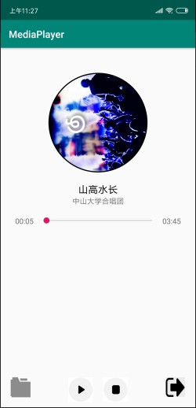
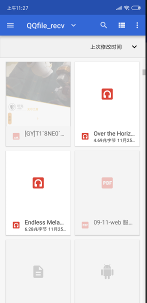
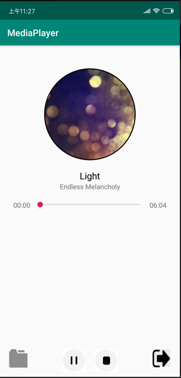

# 中山大学数据科学与计算机学院本科生实验报告
## （2018年秋季学期）
| 课程名称 | 手机平台应用开发 | 任课老师 | 郑贵锋 |
| :------------: | :-------------: | :------------: | :-------------: |
| 年级 | 16级 | 专业（方向） | 计应 |
| 学号 | 16340029 | 姓名 | 陈思琦 |
| 电话 | 13060840852 | Email | 1109349604@qq.com |
| 开始日期 | 2018.11.25 | 完成日期 |2018.11.25|

---

## 一、实验题目的

1. 学会使用MediaPlayer
2. 学会简单的多线程编程，使用Handler更新UI
3. 学会使用Service进行后台工作
4. 学会使用Service与Activity进行通信

---

## 二、实现内容

实现一个简单的播放器，要求功能有：

| 打开程序主页面 | 开始播放 |
| ------------------------------------------------------------ | ------------------------------------------------------------ |
| 暂停 | 停止 |

1. 播放、暂停、停止、退出功能，按停止键会重置封面转角，进度条和播放按钮；按退出键将停止播放并退出程序
2. 后台播放功能，按手机的返回键和home键都不会停止播放，而是转入后台进行播放
3. 进度条显示播放进度、拖动进度条改变进度功能
4. 播放时图片旋转，显示当前播放时间功能，圆形图片的实现使用的是一个开源控件CircleImageView

**附加内容（加分项，加分项每项占10分）**

1.选歌

用户可以点击选歌按钮自己选择歌曲进行播放，要求换歌后不仅能正常实现上述的全部功能，还要求选歌成功后不自动播放，重置播放按钮，重置进度条，重置歌曲封面转动角度，最重要的一点：需要解析mp3文件，并更新封面图片。

---

## 三、课堂实验结果
###  项目结构

```
|-MediaPlayerActivity.java
|-MediaHandler
|-MusicService
```

本次使用了数据绑定，为了避免频繁的通过findViewById来控制视图。

`MediaPlayerActivity`负责绑定handler，负责建立与Service的连接，响应选取文件。

`MediaHandler`处理`MediaPlayer`的一切动作，逻辑处理。

`MusicService`服务，保存歌曲信息，保存`MediaPlayer`。

###  MediaPlayer使用

常用方法：

| 函数                  | 功能                             | 使用时机              |
| --------------------- | -------------------------------- | --------------------- |
| setDataSource(String) | 设置音频文件路径，进入初始化状态 | MediaPlayer对象已创建 |
| prepare()             | 进入就绪状态                     | 已初始化或停止        |
| start()               | 进入播放状态                     | 已就绪                |
| pause()               | 进入暂停状态                     | 正在播放              |
| stop()                | 进入停止状态                     | 正在播放或暂停        |
| isPlaying()           | 检查是否正在播放                 | 任意正常状态          |
| getCurrentPosition()  | 获取当前已播放的毫秒数           | 已就绪                |
| getDuration()         | 获取文件的时间长度（毫秒）       | 已就绪                |
| release()             | 停止播放并释放资源               | 任何时候              |

其次还可以通过设置`setOnCompletionListener`来监听播放器播放完成。

```java
mediaPlayer.setOnCompletionListener(new MediaPlayer.OnCompletionListener() {
    @Override
    public void onCompletion(MediaPlayer mediaPlayer) {
        stop();
    }
});
```

通过`seekTo`方法跳转到指定位置播放。

###  Service使用

`Service`可以看成没有UI界面的`Activity`，`Service`有两种启动方式

* 一是与activity没有数据交互的`startService`，在Activity中可以通过`startService`开启一个`Service`。

  ```
  Intent intent = new Intent(this, MusicService.class);
  startService(intent);
  ```

  如果Service已经启动，当再次`startService`时，进入`onStart`生命周期，而不进入`onCreate`生命周期。

  关闭`Service`

  ```java
  Intent intent = new Intent(this, MusicService.class);
  stopService(intent);
  ```

* 二是本次实验使用的与activity有数据交互的`bindService`。

  ```java
  Intent intent = new Intent(this, MusicService.class);
  startService(intent);
  bindService(intent, sc, BIND_AUTO_CREATE);
  ```

  使用`bindService`需要创建`ServiceConnection`类的对象，重写该类的`onServiceConnected`，在每次`bindService`成功后都会回调该方法，就可以将Service中的数据传给activity。

  ```java
  private ServiceConnection sc = new ServiceConnection() {
      @RequiresApi(api = Build.VERSION_CODES.KITKAT)
      @Override
      public void onServiceConnected(ComponentName name, IBinder binder) {
          binding.getHandler().getService(((MusicService.MyBinder)binder).getService());
  
      }
  
      @Override
      public void onServiceDisconnected(ComponentName name) {
  
      }
  };
  ```

  在`MediaActivity`的`onDestroy`需要`unbindService`取消绑定的连接

  ```java
  @Override
  protected void onDestroy() {
      super.onDestroy();
      unbindService(sc);
  }
  ```

实现了以上内容后，开启Service，播放器就会在后台播放，当切换回来的时候，通过`bindService`重新获取播放器的信息。

### SeekBar使用

基本方法有以下几种：

* `setProgress`设置进度

* `setMax`设置最大进度

* 监听进度条变化

  ```java
  this.binding.seekBar.setOnSeekBarChangeListener(new SeekBar.OnSeekBarChangeListener() {
      @RequiresApi(api = Build.VERSION_CODES.KITKAT)
      @Override
      public void onProgressChanged(SeekBar seekBar, int progress, boolean fromUser) {
          if(fromUser){
              ms.mediaPlayer.seekTo(progress);
          }
      }
  
      @Override
      public void onStartTrackingTouch(SeekBar seekBar) {
  
      }
  
      @Override
      public void onStopTrackingTouch(SeekBar seekBar) {
  
      }
  });
  ```

### 进度更新

Handler开启多线程，可以实现进度条的控制，这次使用简单的`post`和`postDelay`。首先定义一个handler，该handler不要处理Message，在`Runable`的`run`中使用`postDelayed`延迟指定时间再次开启一个线程即可，这样就可以做到每100ms更新一次进度条。

```java
private Handler mHandler = new Handler();
private Runnable mRunnable = new Runnable() {
    @Override
    public void run() {
        binding.nowTime.setText(time.format(ms.mediaPlayer.getCurrentPosition()));
        binding.seekBar.setProgress(ms.mediaPlayer.getCurrentPosition());
        binding.seekBar.setMax(ms.mediaPlayer.getDuration());
        mHandler.postDelayed(mRunnable, 100);
    }
};
```

### 选歌

首先通过`Intent`请求获取文件，通过`setType`指定获取的文件类型。

```java
private void pickFile() {
    Intent intent = new Intent(Intent.ACTION_GET_CONTENT);
    intent.setType("audio/*");
    intent.addCategory(Intent.CATEGORY_OPENABLE);
    activity.startActivityForResult(intent, 1);
}
```

重写`onActivityResult`，接收选取的音频的路径。

```java
@Override
protected void onActivityResult(int requestCode, int resultCode, Intent data) {
    if (resultCode == Activity.RESULT_OK) {
        Uri uri = data.getData();
        if (Build.VERSION.SDK_INT > Build.VERSION_CODES.KITKAT) {//4.4以后
            binding.getHandler().setFile(uri);
        }
    }
}
```

### 解析歌曲信息

使用`MediaMetadataRetriever`，先通过`setDataSource`设置资源，然后通过`extractMetadata`解析出资源。图片的需要使用`getEmbeddedPicture`获取，并且将返回的`byte`转换成`Bitmap`。

```java
MediaMetadataRetriever mmr = new MediaMetadataRetriever();
mmr.setDataSource(activity, uri);
ms.title = mmr.extractMetadata(MediaMetadataRetriever.METADATA_KEY_TITLE);
ms.artist = mmr.extractMetadata(MediaMetadataRetriever.METADATA_KEY_ARTIST);
byte[] artBytes =  mmr.getEmbeddedPicture();
if(artBytes != null)
{
    InputStream is = new ByteArrayInputStream(mmr.getEmbeddedPicture());
    Bitmap bm = BitmapFactory.decodeStream(is);
    ms.img = bm;
    binding.profileImage.setImageBitmap(bm);
}
else
{
    binding.profileImage.setImageDrawable(activity.getResources().getDrawable(R.mipmap.img));
}
```

###  旋转动画

旋转动画使用`objectAnimator`，指定特定的控件，然后设置好时间和渐变效果。

```java
objectAnimator = ObjectAnimator.ofFloat(binding.profileImage, "rotation", 0f, 360f);//添加旋转动画，旋转中心默认为控件中点
objectAnimator.setDuration(3000);//设置动画时间
objectAnimator.setInterpolator(new LinearInterpolator());//动画时间线性渐变
objectAnimator.setRepeatCount(ObjectAnimator.INFINITE);
objectAnimator.setRepeatMode(ObjectAnimator.RESTART);
```

启动动画

```
objectAnimator.start();
```

暂停动画

```java
objectAnimator.pause();
```

从暂停的地方恢复动画

```
objectAnimator.resume();
```

---

###  进程间通信——Binder

`Binder`负责进程间的通信，因此可以用于`Service`和`Activity`之间的通信。`Binder`主要用于继承自`IBinder`，`IBinder`是一个接口，它代表了一种跨进程传输的能力。只要实现了这个接口，就能将这个对象进行跨进程传递。IBinder 是高性能、轻量级远程调用机制的核心部分，它定义了远程操作对象的基本接口。现在介绍最关键的两个接口`transact`和`onTransact`。

`transact`用于给`Binder`发送消息，`transact`可以携带`Activity`和`Service`，并且会阻塞等待`Binder`执行完`onTransact`，了解了工作机制，现在来看下具体实现。

首先需要在自定义的Binder中重写`onTransact`

```java
public class MyBinder extends Binder {

    @Override
    protected boolean onTransact(int code, Parcel data, Parcel reply, int flags) 
        throws RemoteException {
        boolean[] isPlaying = new boolean[1];
        switch (code){
            case 0:
               	//do something
        }
        return super.onTransact(code, data, reply, flags);
    }
}
```

然后是`transact`的使用，在这里需要先了解一下`Parcel`。`Parcel`是一个容器，可以包含数据或者是对象引用，并且能够用于Binder的传输。接下来看看具体如何配合使用：

**Parcel的获取**

`Obtain`的实现是从对象池中取出可用对象，这样可以提高性能以及内存消耗。

```
Parcel parcle = Parcel.Obtain();
```

**Parcel写入数据**

以写入一个Int类型的数据为例

```
parcel.writeInt(int val);
```

**注意**：写入时，可以多次写入，`Parcel`内部的实现可以看成一个管道，采用先进先出的方式。

**Parcel读取数据**

读取数据有两种，一种是readXX，一种是createXX

读取一个`Int`类型的数据

```
parcel.readInt();
```

读取一个`ByteArray`

```
parcel.readByteArray(byte[], offset, length)
parcel.createByteArray();
```

注意两个方法的区别，`readByteArray`需要知道数组的长度，并且将数据赋给你传入的数组，而`createByteArray`则不需要知道数组的长度，并且可以返回存储的数组。

**transact发送数据并获取返回数据**

```java
Parcel data = Parcel.obtain();
Parcel reply = Parcel.obtain();

data.writeString(title);


try {
    // 阻塞等待OnTransaction完成
	myBinder.transact(5, data, reply, 0);
} catch (RemoteException e) {
	e.printStackTrace();
}

String s = reply.readInt();
```

**OnTransaction获取数据并回应**

```java
@Override
protected boolean onTransact(int code, Parcel data, Parcel reply, int flags) 
    throws RemoteException {
    boolean[] isPlaying = new boolean[1];
    switch (code){
        case 5:
            title = data.readString();
            reply.writeInt(mediaPlayer.getDuration());
    }
    return super.onTransact(code, data, reply, flags);
}
```

可以看出通过code可以自定义接收到数据之后的操作，并且通过`Parcel`在进程之间实现通信。

### 观察者模式

本次观察者模式使用`rxJava`实现，首先看一下主体的代码

```java
private final Observable<Integer> observable = Observable.create(new ObservableOnSubscribe<Integer>() {
    @Override
    public void subscribe(ObservableEmitter<Integer> e) throws Exception {
        while (true){
            Parcel data = Parcel.obtain();
            Parcel reply = Parcel.obtain();
            myBinder.transact(1, data, reply, 0);
            e.onNext(reply.readInt());
            Thread.sleep(100);
        }
    }
});

private final Observer<Integer> observer = new Observer<Integer>(){

    @Override
    public void onSubscribe(Disposable d) {

    }

    @RequiresApi(api = Build.VERSION_CODES.KITKAT)
    @Override
    public void onNext(Integer integer) {
        if (integer == -1){
            stop();
        } else {
            binding.nowTime.setText(time.format(integer));
            binding.seekBar.setProgress(integer);
        }
    }

    @Override
    public void onError(Throwable e) {

    }

    @Override
    public void onComplete() {

    }
};
```

`Observable`是被观察者，在这次实验中需要不停的向`Service`发送`Parcel`获取播放器的进度并且将进度的变化告诉观察者。`Oberser`是观察者，需要订阅被观察者，获得播放器的进度并且进行UI的更新。

通过`observable.subsribe`可以订阅被观察者，订阅实现如下：

```java
observable
    .subscribeOn(Schedulers.io())
    .observeOn(AndroidSchedulers.mainThread())
    .subscribe(observer);
```

这里涉及了调度器的实现，其实就是线程切换，将需要快速切换的获取播放器的事物切换到IO线程中，将UI变化切换在主线程中，注意在IO线程中不要做耗时的操作，这样就实现了UI的更新。

### 实验截图

播放


暂停



选歌





切换后台


---

## 五、实验思考及感想

本次实验实现了MediaPlayer播放音乐，主要学习了以下几点

* Java多线程，主要依靠handler和message的机制，通过post发送消息并且回调本身，实现了进度条的更新。
* 解析MP3，通过`MediaMetadataRetriever`获取资源之后，再解析出所需要的资源。
* 动画的实现，`objectAnimator`能非常简便实现旋转。
* 文件选取，TA给的教程用的是ACTION_PICK，通过查询资料发现ACTION_GET_CONTENT也可以实现，两者都可以读取文件，不同的是前者使用`setType`指定获取的内容类型，后者使用`setData`指定获取的内容类型。
* 第二周的作业学习了IPC即进程间通信，直接返回Service的做法不好实现封装，本次使用了`Binder`，进程间的通信很好的控制在Binder上，便于管理。使用`Parcel`进行数据传递的时候，需要注意获取数据和写数据的顺序，可以把`Parcel`内部看成一个FIFO的管道，数据先进先出。
* 观察者模式在本次实验中其实并没有体现的太突出，因为其功能完全可以由一个定时器代替，还有许多`rxJava`的方法没有使用，比如变换等，在以后的学习中希望能做到学以致用。

---

#### 作业要求
* 命名要求：学号_姓名_实验编号，例如12345678_张三_lab1.md
* 实验报告提交格式为md
* 实验内容不允许抄袭，我们要进行代码相似度对比。如发现抄袭，按0分处理