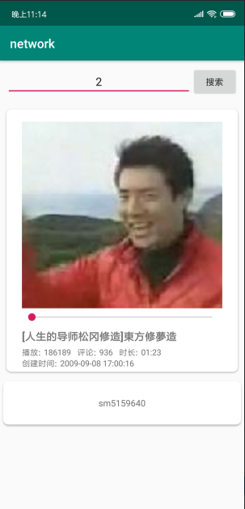
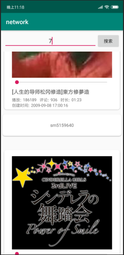
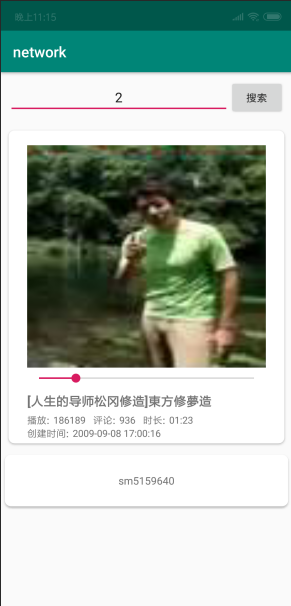
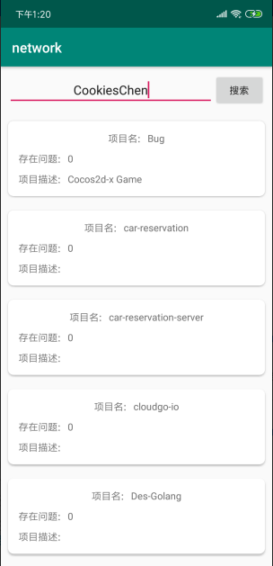
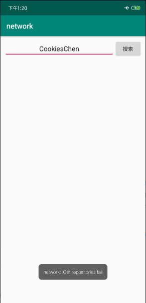
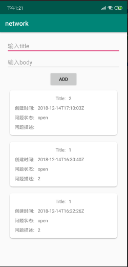
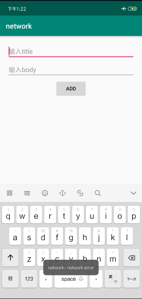
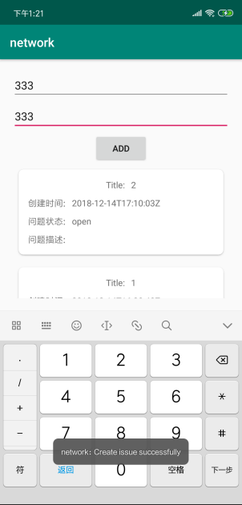
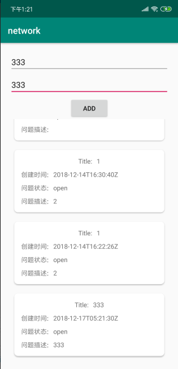
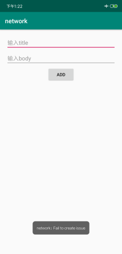

# 中山大学数据科学与计算机学院本科生实验报告
## （2018年秋季学期）
| 课程名称 | 手机平台应用开发 | 任课老师 | 郑贵锋 |
| :------------: | :-------------: | :------------: | :-------------: |
| 年级 | 16级 | 专业（方向） | 计应 |
| 学号 | 16340029 | 姓名 | 陈思琦 |
| 电话 | 13060840852 | Email | 1109349604@qq.com |
| 开始日期 | 2018.11.25 | 完成日期 |2018.11.25|

---

## 一、实验题目的

1. 学会使用HttpURLConnection请求访问Web服务
2. 学习Android线程机制，学会线程更新UI
3. 学会解析JSON数据
4. 学习CardView布局技术

---

## 二、实现内容

####  实现一个bilibili的用户视频信息获取软件

| 打开程序主页面 | 输入用户id，要求正整数int类型，不满足的弹Toast提示即可 |
| ------------------------------------------------------------ | ------------------------------------------------------------ |
| 输入用户id，点击搜索，网络没打开则弹Toast提示网络连接失败 | 网络打开情况下，输入用户id，不存在相应数据的弹Toast提示 |
| 输入用户id = 2，点击搜索，展示图片/播放数/评论/时长/创建时间/标题/简介内容 | 再次输入用户id = 7，接着上次结果继续展示以上内容 |

- 搜索框只允许正整数int类型，不符合的需要弹Toast提示
- 当手机处于飞行模式或关闭wifi和移动数据的网络连接时，需要弹Toast提示
- 由于bilibili的API返回状态有很多，这次我们特别的限制在以下几点
  - 基础信息API接口为： `https://space.bilibili.com/ajax/top/showTop?mid=<user_id>`
  - 图片信息API接口为基础信息API返回的URL，cover字段
  - 只针对前40的用户id进行处理，即`user_id <= 40`
  - [2,7,10,19,20,24,32]都存在数据，需要正确显示
- **在图片加载出来前需要有一个加载条，不要求与加载进度同步**
- 布局和样式没有强制要求，只需要展示图片/播放数/评论/时长/创建时间/标题/简介的内容即可，可以自由发挥
- **布局需要使用到CardView和RecyclerView**
- 每个item最少使用2个CardView，布局怎样好看可以自由发挥，不发挥也行
- 不完成加分项的同学可以不显示SeekBar
- 输入框以及按钮需要一直处于顶部

### 加分项

| 拖动SeekBar，显示相应位置的预览图 | 拖动SeekBar，显示相应位置的预览图 |
| ------------------------------------------------------------ | ------------------------------------------------------------ |
|                                                              |                                                              |

- 拖动前后均显示原图片
- 模拟bilibili网页PC端，完成可拖动的预览功能
- 拖动seekBar，预览图会相应改变
- 前40的用户id中，32不存在预览图，可以忽略也可以跟demo一样将seekbar的enable设置为false
- 需要额外使用两个API接口，分别为
  - 利用之前API获得的信息，得到aid传入`https://api.bilibili.com/pvideo?aid=<aid>`
  - 利用`api.bilibili.com`得到的信息，解析image字段得到`"http://i3.hdslb.com/bfs/videoshot/3668745.jpg` 的图片
  - 分割该图片即可完成预览功能
- 加分项存在一定难度，需要不少额外编码，**可不做**。
- 32不存在预览图，可忽略或处理该异常情况

---

## 三、课堂实验结果
###  项目结构

```
|-MainActivity
|-MainActivityHandler
|-CardAdpater
|-Preview
|-RecyclerObj
|-utils
```

本次使用了数据绑定，为了避免频繁的通过findViewById来控制视图，并且利用数据绑定进行动态更新视图。

`MainActivity`用于数据绑定。

`MainActivityHandler`用于主界面的基本逻辑

`CardAdpater`是`RecyclerView`的适配器，用于更新`RecyclerView`。

`Preview`表示预览图信息，包括预览图分块的数量以及预览图

`RecyclerObj`表示`RecyclerView`的`item`，包含视频的所有信息（除预览图），并且用于Gson解析。

`utils`是辅助函数，用于各种类型的转换，主要处理网络请求后的数据的转换。

### 数据绑定与RecyclerView

之前的实验中已经使用过数据绑定，那么`RecyclerView`和数据绑定如何结合呢？首先还是从布局文件`item.xml`开始，和正常的数据绑定一样，布局文件中只要添加`<layout>`标签，并且在里面定义`<data>`标签即可，本次实验中绑定的数据类是`RecyclerObj`，`<data>`如下：

```xml
<data>
    <variable
              name="recyclerObj"
              type="com.example.cookieschen.network.RecyclerObj"/>
</data>
```

关于如何在布局中使用绑定类中的数据已经在上一次实验中讲述，在这里就不赘述了。

定义好了布局文件，接下来自然就是自定义的适配器了，在这里自定义适配器`CardAdapter`继承`RecyclerView.Adapter<CardAdapter.CardViewHolder>`，`CardAdapter.CardViewHolder`会在稍后讲述，用于控制视图。定义好适配器后，主要需要重写三个函数`onCreateViewHolder`，`onBindViewHolder`，`getItemCount`，并且维护一个`List`。

```java
private List<RecyclerObj> recyclerObjs;

@Override
public CardViewHolder onCreateViewHolder(@NonNull ViewGroup viewGroup, int i) {
    ItemBinding binding = DataBindingUtil.inflate(
        LayoutInflater.from(viewGroup.getContext()), R.layout.item, viewGroup, false);
    return new CardViewHolder(binding);
}

@Override
public void onBindViewHolder(@NonNull final CardViewHolder cardViewHolder, @SuppressLint("RecyclerView") final int i) {
    cardViewHolder.binding.setRecyclerObj(recyclerObjs.get(i)); 
    cardViewHolder.binding.executePendingBindings();
}

@Override
public int getItemCount() {
    if (recyclerObjs == null) return 0;
    return recyclerObjs.size();
}
class CardViewHolder extends RecyclerView.ViewHolder{
    ItemBinding binding;
    CardViewHolder(ItemBinding binding) {
        super(binding.getRoot());
        this.binding = binding;
    }
}
```

可以看到三个函数的作用，在这里介绍两个。`onCreateViewHolder`，用于创建`ViewHolder`，通过`DataBindingUtil.inflate`加载`item.xml`，并且将binding传递给`ViewHolder`。`onBindViewHolder`用于动态更新视图，通过调用`notifyDataSetChanged`可以将新的List数据更新到UI，实现动态更新视图。

### 网络访问

本次作业网络访问还是比较简单的，只要使用了`httpURLConnection`进行请求。首先是访问的权限：

```xml
<uses-permission android:name="android.permission.INTERNET"/>
<uses-permission android:name="android.permission.CHANGE_NETWORK_STATE"/>
```

使用`httpURLConnection`需要设置url和连接请求方式，最后就是通过`getResponseCode`和`GetStringByStream`获取返回码和返回的数据流，然后通过处理数据流得到自己想要的数据。

```java
URL url = new URL("https://space.bilibili.com/ajax/top/showTop?mid=" + id);
HttpURLConnection httpURLConnection = (HttpURLConnection)url.openConnection();
httpURLConnection.setRequestProperty("Content-Type", "application/json; charset=UTF-8");
httpURLConnection.setRequestProperty("Accept", "application/json");
httpURLConnection.setRequestMethod("GET");
httpURLConnection.setConnectTimeout(10 * 1000);
httpURLConnection.setReadTimeout(1000);
int code = httpURLConnection.getResponseCode();
if(code == 200){
    String result = utils.GetStringByStream(httpURLConnection.getInputStream());
    return new Gson().fromJson(result, RecyclerObj.class);
}
```

### JSON解析

得到是数据如下：

```
 {
 	"status": true,
 	"data": {
 		"aid":30087657,
 		"state":0,
 		"cover":"……",
 		"title":"华农兄弟：这只竹鼠打架受内伤，农村小伙只能把它煮了，味道鲜嫩可口"
 		……
 	}
 }
```

首先我们需要声明一个类，这个类包含了我们需要显示的信息，比如：

```java
public class RecyclerObj {
    private Boolean status;
    private Data data;
	public static class Data  {
		private int aid;
		……//省略get set等
	}
	……//省略get，set
}
```

之后直接使用这个解析即可。

```
RecyclerObj recyclerObj = new Gson().fromJson((String)jsonString, RecyclerObj.class);
```

解析需要用到Gson，需要引入依赖 `compile 'com.squareup.retrofit2:converter-gson:2.1.0'`

### CardView使用

引入CardView依赖

```
compile 'com.android.support:cardview-v7:28.+'
```

便可以如同使用正常属性一样使用CardView了

```xml
<android.support.v7.widget.CardView  
  app:cardCornerRadius="8dp"  
  android:layout_width="match_parent"  
  android:layout_height="wrap_content"  
  android:layout_margin="10dp"  
  app:contentPadding="5dp">
</android.support.v7.widget.CardView>
```

布局在这里就不说了，UI设计需要自我磨练...

### Progressbar使用

最简单的设置即可，我们只需要更新其visibility属性即可，这里需要使用到上周的知识，子线程更新UI。

```
<!--设置progressbar的格式-->
style="?android:attr/progressBarStyleLarge"
<!--也可以使用其他格式-->
style="?android:attr/progressBarStyleInverse" 
style="?android:attr/progressBarStyleLargeInverse" 
style="?android:attr/progressBarStyleSmall" 
style="?android:attr/progressBarStyleSmallInverse" 
style="?android:attr/progressBarStyleSmallTitle" 
```

### 多线程

本次实验使用`RxJava`实现线程，一共有三处使用了线程，三次http请求。

**搜索添加**

```java
Observable<RecyclerObj> observable = Observable.create(new ObservableOnSubscribe<RecyclerObj>() {
    @Override
    public void subscribe(ObservableEmitter<RecyclerObj> e) {
        RecyclerObj recyclerObj = getData(id);
        e.onNext(recyclerObj);
    }
});

Observer<RecyclerObj> observer = new Observer<RecyclerObj>() {
    @Override
    public void onSubscribe(Disposable d) {

    }

    @Override
    public void onNext(RecyclerObj value) {
        if(value.getStatus()){
            CardAdapter cardAdapter = (CardAdapter) binding.recyclerView.getAdapter();
            assert cardAdapter != null;
            int index = cardAdapter.addItem(value);
            getCover(index, value);
            getPreviewInfo(index, value);
        } else {
            Toast.makeText(activity, "数据库中不存在记录", Toast.LENGTH_SHORT).show();
        }
    }

    @Override
    public void onError(Throwable e) {

    }

    @Override
    public void onComplete() {

    }
};

observable
                .subscribeOn(Schedulers.io())
    .observeOn(AndroidSchedulers.mainThread())
    .subscribe(observer);
```

观察者模式在上一次实验中已经说明，在这里实现也是基本相似，被观察者开启线程，当线程执行完成网络访问后，通过`onNext`将数据传送给观察者，观察者对`Adapter`进行操作，更新UI。

**获取预览图信息**与上面操作相似，就不详细讲述了。

**获取预览图**

获取完成预览图信息之后，我们会获取到一个图片的`url`数组，因为预览图可能不止一张，在这里需要按顺序获取预览图，进行图片分割。

```java
Observable<Bitmap> observable = Observable.create(new ObservableOnSubscribe<Bitmap>() {
    @Override
    public void subscribe(ObservableEmitter<Bitmap> e) {
        for(String urlString : preview.getData().getImage()){
            try {
                URL url = new URL(urlString);
                HttpURLConnection httpURLConnection = (HttpURLConnection)url.openConnection();
                httpURLConnection.setRequestProperty("Content-Type", "application/json; charset=UTF-8");
                httpURLConnection.setRequestProperty("Accept", "application/json");
                httpURLConnection.setRequestMethod("GET");
                httpURLConnection.setConnectTimeout(10 * 1000);
                httpURLConnection.setReadTimeout(1000);
                int code = httpURLConnection.getResponseCode();
                if(code == 200){
                e.onNext(utils.GetBitmapByStream(httpURLConnection.getInputStream()));
                }
            } catch (ProtocolException err) {
                err.printStackTrace();
            } catch (MalformedURLException err) {
                err.printStackTrace();
            } catch (IOException err) {
                err.printStackTrace();
            }
        }
        e.onComplete();
    }
});

Observer<Bitmap> observer = new Observer<Bitmap>() {
    @Override
    public void onSubscribe(Disposable d) {

    }

    @Override
    public void onNext(Bitmap value) {
        List<Bitmap> bitmaps = utils.GetBitmaps(value, preview.getData().getImg_x_len(), preview.getData().getImg_y_len());
        CardAdapter cardAdapter = (CardAdapter) binding.recyclerView.getAdapter();
        assert cardAdapter != null;
        cardAdapter.addPreviews(bitmaps, index);
    }

    @Override
    public void onError(Throwable e) {

    }

    @Override
    public void onComplete() {
        CardAdapter cardAdapter = (CardAdapter) binding.recyclerView.getAdapter();
        assert cardAdapter != null;
        cardAdapter.refresh();
    }
};

observable
    .subscribeOn(Schedulers.io())
    .observeOn(AndroidSchedulers.mainThread())
    .subscribe(observer);
```

线程开启的方式还是比较相似的，最主要是`onNext`和`onComplete`的使用，这个就涉及到了RxJava的工作原理，首先被观察者通过`onNext`发送消息，这些消息形成一个队列，采用先进先出的方式，而当完成的时候可以通过`onComplete`通知观察者，这样就可以实现顺序的进行网络访问，得到的预览图就是按顺序的。

### 加分项

**图片分割**

分割还是比较简单的，直接看一下代码

```java
static List<Bitmap> GetBitmaps(Bitmap bitmap, int xLen, int yLen) {
	List<Bitmap> pieces = new ArrayList<>();
    int width = bitmap.getWidth();
    int height = bitmap.getHeight();
    int pieceWidth = width / xLen;
    int pieceHeight = height / yLen;
    for (int i = 0; i < xLen; i++) {
        for (int j = 0; j < yLen; j++) {
            int xValue = j * pieceWidth;
            int yValue = i * pieceHeight;
            pieces.add(Bitmap.createBitmap(bitmap, xValue, yValue,
                                           pieceWidth, pieceHeight));
        }
    }

    return pieces;
}
```

**预览图控制**

这里主要利用了seekbar的两个函数`onProgressChanged`和`onStopTrackingTouch`，两个函数分别是seekbar进度被拖动时和进度条停止拖动后触发。

```java
@Override
public void onProgressChanged(SeekBar seekBar, int progress, boolean fromUser) {
    if (fromUser) {
        cardViewHolder.binding.cover.setImageBitmap(recyclerObjs.get(i).
                                                    getPreviews().get(progress));
    }
}

@Override
public void onStopTrackingTouch(SeekBar seekBar) {
    cardViewHolder.binding.seekbar.setProgress(0);
    cardViewHolder.binding.cover.setImageBitmap(recyclerObjs.get(i).getBitmap());
}
                
```

具体`setOnSeekBarChangeListener`是在Adapter中的`onBindViewHolder`实现的，每次获取并且分割预览图完成后，执行一次`notifyDataSetChanged`，就能刷新视图，调用一次`onBindViewHolder`。

### 实验截图

搜索添加



多次搜索添加



预览图



---

## 五、实验思考及感想

本次实验实现了网络请求，主要学习了以下几点

* 网络请求：`httpURLConnection`请求需要在线程中进行，如果在主线程中会出现线程状态不安全的报错。
* 本次实验中使用`Gson`进行`JSON`解析，需要注意的是，当数据库不存在记录时，返回的数据`data`字段不能成功被解析，此时会抛出`JsonSyntaxException`异常，可以通过捕获这个异常进行操作。
* 上一次使用数据绑定没有充分使用，这次发现数据绑定可以动态更新视图，这一点非常重要！
* 异常处理，因为使用Rxjava进行异步请求，请求在线程中进行，因此发生异常时被观察者需要抛出异常，然后交给主线程的观察者处理，不要在线程中进行UI更新或者显示Toast。

---

# 中山大学数据科学与计算机学院本科生实验报告

## （2018年秋季学期）

| 课程名称 | 手机平台应用开发 |   任课老师   |      郑贵锋       |
| :------: | :--------------: | :----------: | :---------------: |
|   年级   |       16级       | 专业（方向） |       计应        |
|   学号   |     16340029     |     姓名     |      陈思琦       |
|   电话   |   13060840852    |    Email     | 1109349604@qq.com |
| 开始日期 |    2018.11.25    |   完成日期   |    2018.11.25     |

------

## 一、实验题目的

1. 理解Restful接口
2. 学会使用Retrofit2
3. 复习使用RxJava
4. 学会使用OkHttp

------

## 二、实现内容

###  基础实验内容

#### 实现一个github用户repos以及issues应用

| 主界面有两个跳转按钮分别对应两次作业 | github界面，输入用户名搜索该用户所有可提交issue的repo，每个item可点击 |
| ------------------------------------------------------------ | ------------------------------------------------------------ |
| repo详情界面，显示该repo所有的issues | 加分项：在该用户的该repo下增加一条issue，输入title和body即可 |

- 教程位于`./manual/tutorial_retrofit.md`
- 每次点击搜索按钮都会清空上次搜索结果再进行新一轮的搜索
- 获取repos时需要处理以下异常：HTTP 404 以及 用户没有任何repo
- 只显示 has_issues = true 的repo（即fork的他人的项目不会显示）
- repo显示的样式自由发挥，显示的内容可以自由增加（不能减少）
- repo的item可以点击跳转至下一界面
- 该repo不存在任何issue时需要弹Toast提示
- 不完成加分项的同学只需要显示所有issues即可，样式自由发挥，内容可以增加

### 加分项

- 加分项旨在学习Retrofit2的POST请求，加深Rest API的理解
- demo需要你们额外提供TOKEN参数，这点不必实现，实现了反而不利于检查
- 提交的代码可以删除掉你的token等授权信息
- 仅处理提交成功与提交失败两种状态
- issue提交成功后需要刷新展示出来
- **加分项注意事项**
- **不要在他人repo下随意提交issue测试，自己新建一个repo即可**
- **管理好自己的github授权（token，client id等），验收结束后请删除对应授权**

------

## 三、课堂实验结果

### OkHttp使用

HTTP是现代应用常用的一种交换数据和媒体的网络方式，高效地使用HTTP能让资源加载更快，节省带宽。`OkHttp`是一个高效的HTTP客户端，它有以下默认特性：

- 支持HTTP/2，允许所有同一个主机地址的请求共享同一个socket连接
- 连接池减少请求延时
- 透明的GZIP压缩减少响应数据的大小
- 缓存响应内容，避免一些完全重复的请求

当网络出现问题的时候OkHttp依然坚守自己的职责，它会自动恢复一般的连接问题，如果你的服务有多个IP地址，当第一个IP请求失败时，OkHttp会交替尝试你配置的其他IP，OkHttp使用现代TLS技术(SNI, ALPN)初始化新的连接，当握手失败时会回退到TLS 1.0。

使用`OkHttp`需要先添加以下依赖：

```xml
implementation 'com.squareup.okhttp3:okhttp:3.10.0'
```

`OkHttp`在本次项目的作用主要是设置连接的各种属性。

```java
OkHttpClient build = new OkHttpClient.Builder()
                .connectTimeout(2, TimeUnit.SECONDS)
                .readTimeout(2, TimeUnit.SECONDS)
                .writeTimeout(2, TimeUnit.SECONDS)
                .build();
```

### Retrofit2、RxJava和OkHttp

Retrofit 是一个 RESTful 的 HTTP 网络请求框架的封装，网络请求的工作本质上是 `OkHttp` 完成，而 Retrofit 仅负责 网络请求接口的封装。使用`Retrofit`有以下几个步骤：

**添加依赖**

```
implementation 'com.squareup.retrofit2:retrofit:2.2.0'
```

**创建model类**

本次实验需要两个`model`类，`Repo`和`Issue`，这两个类用于网络请求后，接收请求后JSON数据。

```java
public class Repo {
	String name;
	String description;
	Boolean has_issues;
	int open_issues;
}

public class Issue {
    private String title;
    private String state;
    private String created_at;
    private String body;
}
```

**创建描述网络请求的接口**

Retrofit将 Http请求 抽象成 Java接口：采用 **注解** 描述网络请求参数 和配置网络请求参数。本次实验使用了个接口，分别用于请求仓库和Issue。

```java
// 仓库请求接口
public interface GitHubRequest {
    @GET("/users/{username}/repos")
    Observable<List<Repo>> getRepo(@Path("username") String username);
}
// Issue请求接口
public interface IssueRequest {
    @GET("/repos/{username}/{repoName}/issues")
    Observable<List<Issue>> getIssues(@Path("username") String username, @Path("repoName") String repoName);

    @Headers({"Content-Type: application/json","Accept: application/json"})
    @POST("/repos/{username}/{repoName}/issues")
    Observable<Issue> addIssue(@Path("username") String username, @Path("repoName") String repoName,
                               @Body RequestBody route, @Query("access_token") String token);
}
```

注解类型对应着HTTP的网络请求方式，这里使用了两种`GET`和`POST`，网络请求参数`Path`可以动态地决定URL。

**创建Retrofit实例**

```java
Retrofit retrofit = new Retrofit.Builder()
                .baseUrl(baseURL)
                .addConverterFactory(GsonConverterFactory.create())
                .addCallAdapterFactory(RxJava2CallAdapterFactory.create())
                .client(build)
                .build();
```

创建实例的时候，需要传入URL以及上面定义的OkHttp实例，然后是数据解析器（`Converter`），`Retrofit`支持多种数据解析器，本次实验请求返回的数据是`JSON`类型，因此使用`GSON`解析器，使用解析器需要添加依赖

```
implementation 'com.squareup.retrofit2:converter-gson:2.1.0'
```

最后就是网络请求适配器，本次实验使用`RxJava`作为网络请求适配器，在这里需要注意的是，使用的是`RxJava2`，因此在添加依赖的时候，需要注意

```xml
implementation 'com.squareup.retrofit2:adapter-rxjava2:2.2.0'
```

那么如何结合起来使用呢，可以看到上面接口的代码，网络请求之后，数据解析器会将`OkHttp`请求到的`JSON`数据解析成自己定义的`Model`类，然后交给网络适配器进行处理，这里网络适配器是`RxJava`，请求是在线程中实现了，返回的是被观察者，因此我们需要自己定义观察者对被观察者进行订阅，然后就能处理网络请求的结果。

**创建网络请求接口实例**

```
GitHubRequest request = retrofit.create(GitHubRequest.class);
```

**发送网络请求**

```java
request.getRepo(username)
    .subscribeOn(Schedulers.io())
    .observeOn(AndroidSchedulers.mainThread())
    .subscribe(new Observer<List<Repo>>() {
        @Override
        public void onSubscribe(Disposable d) {

        }

        @Override
        public void onNext(List<Repo> value) {
            // HTTP 200
        }

        @Override
        public void onError(Throwable e) {
            // HTTP 404
            Toast.makeText(activity, "no this user", Toast.LENGTH_SHORT).show();
        }

        @Override
        public void onComplete() {

        }
    });
```

处理网络请求就是RxJava的内容了，在这里就不赘述了。

### 加分项

加分项主要是涉及到了`Retrofit`的POST请求以及`GITHUB`认证方式`Token`的使用。

**POST请求发送JSON数据**

网络接口代码上面已经给出了，在这里主要需要说明的是如何发送JSON数据，首先是在网络接口中使用注解`Body`，并且在请求上使用注解`Header`，说明发送的数据是`JSON`类型，最后就是生成`JSON`数据并且发送了。

```java
String title = binding.title.getText().toString();
String body = binding.body.getText().toString();
String token = "***";

JsonObject jsonObject = new JsonObject();
jsonObject.addProperty("title", title);
jsonObject.addProperty("body", body);
RequestBody requestBody = RequestBody.create(okhttp3.MediaType.parse("application/json; charset=utf-8"), jsonObject.toString());
```

**GITHUB TOKEN**

关于TOKEN如何获取可以看到这篇[博客](https://blog.csdn.net/ltstud/article/details/75949726)

### 实验截图

请求仓库



请求仓库失败，没有该用户或者没有网络连接



请求Issue



请求Issue失败，没有网络连接



创建Issue





创建Issue失败，没有权限或没有网络



------

  ## 五、实验思考及感想

  本次实验实现了网络请求，主要学习了以下几点

  - `Retrofit`封装了`OkHttp`，使得网络请求符合RESTFUL架构。
  - `Retrofit`和`RxJava`结合，`Retrofit`将网络请求封装成被观察者，观察者的实现交给自己实现。

遇到的困难：

* 网络请求适配器不兼容，使用`RxJava`而非`RxJava2`的网络请求适配器无法正常工作，更换依赖即可。
* 更改`JAVA`文件名，因为上一次实验的命名比较乱，本次项目就对上一次实验的所有`JAVA`文件名都进行了统一，因为使用了数据绑定，生成的数据绑定类的文件并没有同步，需要清空build，再次编译出这些数据绑定类的文件才能成功实现。