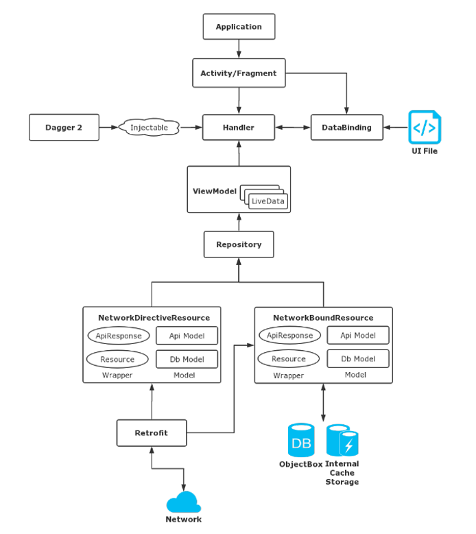
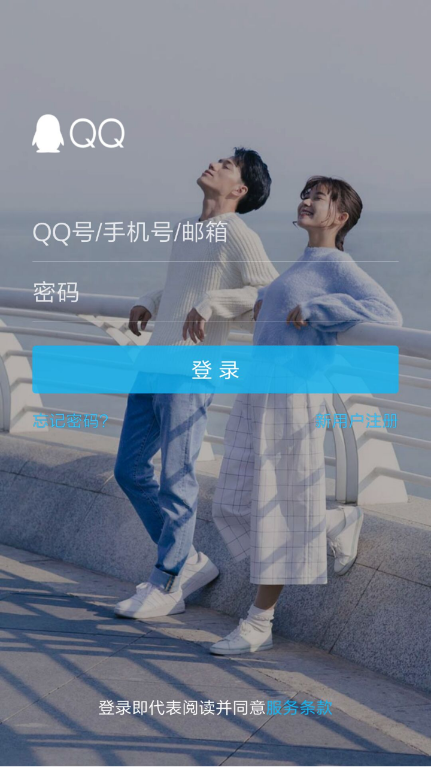
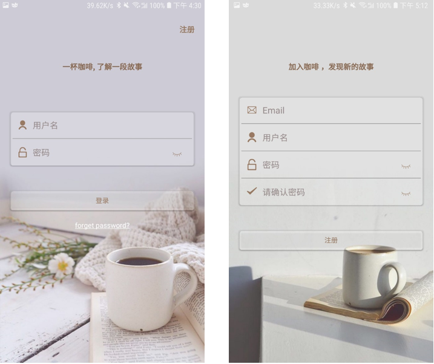
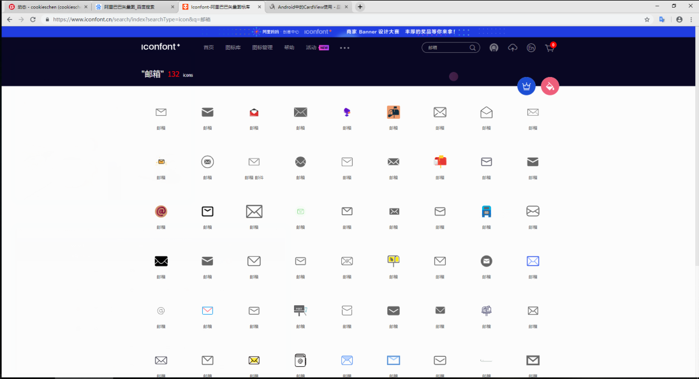
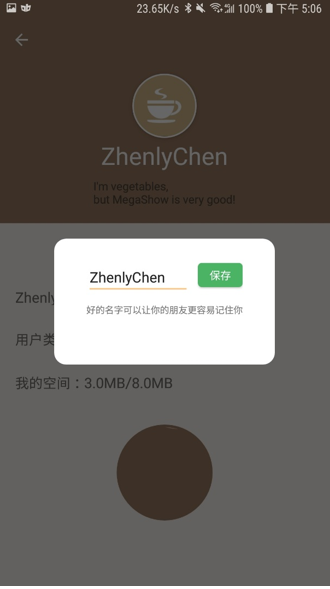

# 中山大学数据科学与计算机学院本科生实验报告
## （2018年秋季学期）
| 课程名称 | 手机平台应用开发 | 任课老师 | 郑贵锋 |
| :------------: | :-------------: | :------------: | :-------------: |
| 年级 | 16级 | 专业（方向） | 计应 |
| 学号 | 16340029 | 姓名 | 陈思琦 |
| 电话 | 13060840852 | Email | 1109349604@qq.com |
| 开始日期 | 2019.1.18 | 完成日期 |2019.1.18|

---

## 期末项目简介

项目名：Coffee

功能：一个定位于分享、管理数据的社交工具，专门为局域网数据存储和分享设计。只需要在局域网内的一台设备上部署Coffee，可以在PC、平板、手机上共享你的文章、图片等数据。想与你的好友分享你的相册？只需要把你的相册设置为公开，你的好友就可以在Coffee上查看你的相册，下载高清大图。Coffee项目源于NAS管理解决方案。

* 发布、管理内容
  * Coffee允许您发布、管理纯文字、带图片文字的内容，您可以选择公开或者隐藏您的内容。
* 点赞感兴趣的内容
  * Coffee允许您对感兴趣的内容、评论点赞，每一次赞同都是对对方的一次认可。
* 评论感兴趣的内容
  * Coffee提供完善的评论系统，对您所感兴趣的内容进行评论，和内容的主人进行交流吧。
* 获取互动通知
  * 当您收到他人的评论和点赞时，Coffee都会通过通知系统告知您，不会错过任何一次互动的消息。

简单来说，就是一个类似于微博的社交应用。

## 期末项目完成工作简介

本次期末项目使用`MVVM`设计模式，与期中项目一致。

首先介绍一下`Model`，数据的来源有两种，一是本地保存的数据，二是从官网获取的数据。采取这种形式的原因有两个。

* 避免没有网络时，无法获取数据，这时候就可以从本地保存的数据中获取
* 每次有网络的时候，就会去获取数据，如果数据有更新，就把数据保存到本地，这样可以实现数据的及时更新。

`ViewModel`则是沟通View与Model的桥梁，`ViewModel`使用`LiveData`类，`LiveData`类是一个数据持有类，数据能够被观察者订阅，只有组件在激活状态下才会通知观察者有数据更新，`LiveData`能够保证数据和UI统一，`LiveData`是被观察者，在这里View为观察者，`LiveData`的数据发生改变时，才会通知View进行更新，在这里对性能是有非常大的提升的，在第一次获取数据之后，如果数据没有更新，则第二次获取就会直接采用第一次的数据。

`View`则主要使用了数据绑定(`DataBinding`)。

将UI的控制交给`Handler`处理，在使用`ViewModel`获取数据，实现前后端分离。

以下是我们期末项目的结构图：



本次期中项目我负责的是英雄详情界面的布局以及内部逻辑，主要工作有以下几点：

- 登录、注册和验证界面以及个人详情页面。
- 使用数据绑定
- 使用LiveData获取数据
- 测试数据接口

---

## 实验结果
###  页面UI

本次登录、注册和验证界面的UI，主要参考了QQ的登录界面，设计的理念就是`文艺`和`小清新`。




####  登录注册界面布局效果



#### CardView使用

上面的布局主要使用了`CardView`，Android 5.0 版本中新增了`CardView`，`CardView`继承自FrameLayout类，并且可以设置圆角和阴影，使得控件具有立体性，也可以包含其他的布局容器和控件。要使用CardView首先要导入包

```
compile 'com.android.support:cardview-v7:22.1.0'
```

导入成功后就可以直接在布局文件中使用，现在来看一下CardView的使用。

```xml
<android.support.v7.widget.CardView
			android:id="@+id/login_cardView"
			android:layout_width="match_parent"
			android:layout_height="wrap_content"
			app:layout_constraintLeft_toLeftOf="parent"
			app:layout_constraintRight_toRightOf="parent"
			app:cardCornerRadius="5dp"
			app:layout_constraintTop_toBottomOf="@+id/login_title"
			android:layout_marginTop="80dp"
            android:layout_marginEnd="20dp"
            android:layout_marginStart="20dp">
            
           	//其他布局
           	
</android.support.v7.widget.CardView>
```

本次只使用了圆角的设置，因为页面整体要求`CardView`是透明的，设置阴影会影响美观。

#### 透明度使用

本次界面最关键就是透明度的设置，因为在布局文件中尝试了，发现无法正常设置透明度，只能在代码中实现了，在控制UI的`Handler`中，进行透明度设置，具体的效果需要自己慢慢尝试，设置的`Alpha`值范围为0~255,0为透明，255为不透明，本次界面中背景的透明度设置为210，CardView以及按钮的背景设置为50。

```
binding.loginButton.getBackground().setAlpha(50);
binding.loginButtonCardView.getBackground().setAlpha(50);
binding.linearLayout.getBackground().setAlpha(210);
```

### 按钮设计

本次使用`CardView`和`Button`来实现按钮

```xml
<android.support.v7.widget.CardView
    android:id="@+id/login_button_cardView"
    android:layout_width="match_parent"
    android:layout_height="wrap_content"
    app:layout_constraintLeft_toLeftOf="parent"
    app:layout_constraintRight_toRightOf="parent"
    app:layout_constraintTop_toBottomOf="@+id/login_cardView"
    app:cardCornerRadius="5dp"
    android:layout_marginTop="50dp"
    android:layout_marginEnd="20dp"
    android:layout_marginStart="20dp"
    android:padding="5dp">
    <Button
            android:id="@+id/login_button"
            android:layout_width="match_parent"
            android:layout_height="40dp"
            android:foreground="?attr/selectableItemBackground"
            android:translationZ="5dp"
            android:elevation="5dp"
            android:textColor="@color/colorPrimary"
            android:text="@string/login_text"/>
    
 </android.support.v7.widget.CardView>
```

在这里需要注意Button的`background`和`foreground`的设置，前景可以使用系统自带的点击特效，背景保留在代码中设置透明度，就和上面所示的一样。

#### `SVG`矢量图使用

本次实验中使用了挺多矢量图的，首先是找到好的素材，在这里推荐[Iconfont-阿里巴巴矢量图标库](https://www.iconfont.cn/)。



找到之后下载SVG文件，用浏览器打开文件，再按F12查看元素，复制路径即可。

然后就是在drawable中新建一个xml文件，在这里以`ic_email`为例子。

```xml
<vector
	xmlns:android="http://schemas.android.com/apk/res/android"
	xmlns:tools="http://schemas.android.com/tools"
	android:width="200dp"
	android:height="200dp"
	android:viewportWidth="1024"
	android:viewportHeight="1024">
	<path
		android:fillColor="@color/colorPrimary"
		android:pathData="M860.7 192.6h-697c-27.5 0-49.8 22.3-49.8 49.8V780c0 27.5 22.3 49.8 49.8 49.8h697c3.7 0 7.4-0.4 11-1.2 6.3 0 12.3-2.3 16.9-6.5v-1.5c13.5-9.1 21.7-24.3 21.9-40.6V242.3c0-27.5-22.3-49.7-49.8-49.7zM512.2 556L169.9 248.6h686.6L512.2 556zM163.7 309.8l229.5 206.4-229.5 228.7V309.8z m266.6 238.7l66.2 59.5c9.4 8.4 23.7 8.4 33.1 0l70.5-63 215.8 235H198.8l231.5-231.5z m206.3-36.8l224-199.1v443.1l-224-244z m0 0"
		tools:ignore="VectorPath" />

</vector>
```

使用的时候，只需要将`pathData`换成刚刚从SVG文件中复制的路径即可，然后可以自己调整颜色等。

#### 邮箱获取倒计时实现

后端使用了组员自己编写的认证系统，在注册成功后需要进行邮箱验证，这里API限制了每60S才能获取一次邮箱验证码，因此需要在前端也做一些限制，这里使用到了`Timer`和`TimerTask`以及`Handler`。

首先是`Handler`的初始化，在本界面中需要处理倒计时，先设定`message.what`为0时，在`Handler`中进行倒计时UI操作。

```java
@SuppressLint("HandlerLeak")
private Handler handler = new Handler(){
    @SuppressLint({"DefaultLocale", "ResourceAsColor"})
    public void handleMessage(Message message){
        switch (message.what){
            case 0:
                if (time > 0){
                    binding.validButtonCode.setText(String.format("重新获取(%ds)", time));
                } else {
                    timer.cancel();
                    timertask.cancel();
                    timer = null;
                    timertask = null;
                    time = WAIT_TIME;
                    binding.validButtonCode.setText("获取验证码");
                    binding.validButtonCode.setBackground(activity.getResources().getDrawable(R.drawable.round_button));
                    binding.validButtonCode.setTextColor(R.color.colorGreen);
                    binding.validButtonCode.setClickable(true);
                }
                break;
        }
    }
};
```

收到返回的信息之后，在主进程中进行UI更新，并且操作时间，在`Handler`中还需要监看是否倒计时完毕，如果倒计时完毕，需要取消倒计时器。

接下来看看如何启动倒计时器。倒计时器主要由`timer`和`timerTask`实现，`timer`通过`schedule`方法调用`timerTask`，通过设置好延迟和间隔，可以实现循环调用。`timerTask`则需要重写`run`函数，每次执行`run`需要向`Handler`发送`message.what`为0的信息。

```java
 timertask = new TimerTask() {
     @Override
     public void run() {
         time--;
         Message message = new Message();
         message.what = 0;
         handler.sendMessage(message);
     }
 };
timer = new Timer();
timer.schedule(timertask, 1000, 1000);
```

实验效果：


#### 个人详情界面

布局与期中项目的英雄详情一样，使用了可折叠的布局，在这里就不赘述了，这里主要推荐一下引入的一个第三方库`CircularFillableLoaders`，因为本应用提供文件上传的功能，每个人都可以拥有一定量的上传量，用该控件可以直观的显示用户可用量。


使用的时候需要先导入包

```
implementation 'com.mikhaellopez:circularfillableloaders:1.3.2'
```

然后在布局文件中引入

```xml
<com.mikhaellopez.circularfillableloaders.CircularFillableLoaders
    android:id="@+id/circularFillableLoaders"
    android:layout_width="120dp"
    android:layout_height="120dp"
    android:layout_marginTop="40dp"
    android:tooltipText="4.5MB/8.0MB"
    app:cfl_border="true"
    app:cfl_border_width="3dp"
    app:cfl_progress="40"
    app:cfl_wave_amplitude="0.06"
    app:cfl_wave_color="@color/colorPrimary"
    app:layout_constraintEnd_toEndOf="parent"
    app:layout_constraintStart_toStartOf="parent"
    app:layout_constraintTop_toBottomOf="@id/person_text_cap" />
```

#### 自定义Dialog更改昵称

更改昵称使用自定义的`Dialog`实现，主要需要实现`NameDialog`类和`NameDialogHandler`类。

`NameDialog`类实现的功能与activity差不多，只需要设置好数据绑定的数据和视图layout即可。

```java
class NameDialog extends Dialog {

    private PersonalNameDialogBinding binding;

    NameDialog(PersonActivity activity, String name,PersonHandler.MyInterface myListener) {
        super(activity, R.style.NameDialog);
        binding = DataBindingUtil.inflate(LayoutInflater.from(activity), R.layout.personal_name_dialog, null, false);
        setContentView(binding.getRoot());
        binding.setHandler(new NameDialogHandler(activity, binding, name, myListener));
    }

    @Override
    protected void onCreate(Bundle savedInstanceState){
        super.onCreate(savedInstanceState);
    }
}
```

`NameDialogHandler`类需要初始化UI以及设置好事件监听即可。

在activity中调用`NameDialog`只需要构造该类并且设置好属性，show即可。

```java
ameDialog dialog = 
    new NameDialog(activity, binding.personTitle.getText().toString(), myListener);
dialog.setCancelable(true);
Objects.requireNonNull(dialog.getWindow()).setGravity(Gravity.CENTER);
dialog.show();
```

最后在`style.xml`中定义好属性

```xml
<!--自定义dialog背景全透明无边框theme -->
<style name="NameDialog" parent="android:style/Theme.Dialog">
    <!--背景颜色及和透明程度-->
    <item name="android:windowBackground">@android:color/transparent</item>
    <!--是否去除标题 -->
    <item name="android:windowNoTitle">true</item>
    <!--是否去除边框-->
    <item name="android:windowFrame">@null</item>
    <!--是否浮现在activity之上-->
    <item name="android:windowIsFloating">true</item>
    <!--是否模糊-->
    <item name="android:backgroundDimEnabled">true</item>
</style>
```

#### Activity和自定义Dialog之间的通信

不严谨的说，其实`Activity`中调用`NameDialog`和`Activity`之间的切换非常类似，本次实现中，希望所有对数据的操作都集中到Activity中实现，但是NameDialog结束后并没有方法传参返回Activity。这时就可以使用接口类了，在Activity中定义好接口

```java
interface MyInterface {
    void changName(String s);
}

private MyInterface myListener = new MyInterface(){

    @Override
    public void changName(String s) {
        viewModel.updateUserName(s).observe(activity, res->{
            assert res != null;
            if (res.getStatus() == Status.SUCCESS){
                switch (Objects.requireNonNull(res.getData()).getState()){
                    case StatusSuccess:
                        Toast.makeText(activity, "已修改" , Toast.LENGTH_SHORT).show();
                        break;
                }
            } else if (res.getStatus() == Status.ERROR){
                Toast.makeText(activity, "请检查网络连接", Toast.LENGTH_SHORT).show();
            }
        });
    }
};
```

然后将该接口传入NameDialog中，在修改完成后调用即可。

```java
private void save() {
    String saveName = binding.name.getText().toString();
    if (saveName.equals(name)){
        Toast.makeText(activity, "请修改昵称", Toast.LENGTH_SHORT).show();
    } else {
        myListener.changName(saveName);
    }
}
```

其中myListener就是传入的接口实例。



###  数据获取

####  数据绑定

想使用数据绑定，首先需要在`Gradle`中android下设置

```
dataBinding {
	enabled = true
}
```

然后就是在xml布局文件中最外层添加`layout`标签，并且添加新的标签`data`，在`data`中声明需要绑定的变量，本次实验中每个layout文件都会有一个对应的handler处理该布局的逻辑以及UI。

```xml
<?xml version="1.0" encoding="utf-8"?>
<layout xmlns:android="http://schemas.android.com/apk/res/android"
    xmlns:app="http://schemas.android.com/apk/res-auto"
    xmlns:tool="http://schemas.android.com/tools">

    <data>
        <variable 
           name="handler" 
           type="studio.xmatrix.coffee.ui.admin.AdminActivityHandler"/>
    </data>

    // your layout
</layout>
```

在对应的java文件中，通过DataBindingUtil加载布局，需要通过`setHandler`绑定到特定的类上。

```java
 @Override
protected void onCreate(@Nullable Bundle savedInstanceState) {
    super.onCreate(savedInstanceState);
    View decorView = getWindow().getDecorView();
    decorView.setSystemUiVisibility(View.SYSTEM_UI_FLAG_LAYOUT_FULLSCREEN 
                                    | View.SYSTEM_UI_FLAG_LAYOUT_STABLE);
    getWindow().setStatusBarColor(Color.TRANSPARENT);
    AdminActivityBinding binding = DataBindingUtil.
        setContentView(this, R.layout.admin_activity);
    binding.setHandler(new AdminActivityHandler(this, binding));
}
```

然后就可以通过`binding`愉快的进行处理了，`binding`可以获取布局中的所有控件，例如id为progress_skill的一个进度条，可以通过`binding.progressSkill`获得。

在布局文件中，可以通过绑定handler的变量进行数据绑定，比如一个`TextView`，可以设置其属性如下:

```xml
<TextView
    	  android:id="@+id/hero_relation_text"
          android:layout_width="wrap_content"
          android:layout_height="wrap_content"
          android:layout_marginStart="5dp"
          android:layout_marginTop="5dp"
          android:text="@{handler.title}"
          android:textSize="15sp"
          android:textStyle="bold" />
```

在handler中设置属性`title`，并且设置好setter和getter方法，就可以实现数据绑定了。其他的三元运算等操作，在这不做太多的介绍。

 #### 接口使用

以登录为例子，看到秀秀写的`ViewModel`中提供的`LiveData`

```java
LiveData<Resource<CommonResource>> login(String name, String password) {
    return userRepository.login(name, password);
}
```

可以看到，后端组员提供了非常简洁的接口，所有的接口都返回`LiveData`类型，该类型有三种状态，Loading、Success和Error，Loading主要为了可以添加加载动画，而后两者则是请求的状态。

```java
viewModel.login(username, password).observe(activity, res -> {
    assert res != null;
    if (res.getStatus() == Status.SUCCESS){
        switch (Objects.requireNonNull(res.getData()).getState()){
            case StatusSuccess:
                activity.finish();
                break;
            case StatusError:
                Toast.makeText(activity, errMsg.loginFail, Toast.LENGTH_SHORT).show();
                break;
            case StatusNotValid:
                Intent intent = new Intent(activity.getBaseContext(), ValidActivity.class);
                Bundle bundle = new Bundle();
                bundle.putString("email", res.getData().getResource());
                intent.putExtras(bundle);
                activity.startActivity(intent);
        }
    } else if (res.getStatus() == Status.ERROR){
        Toast.makeText(activity, errMsg.errNetwork, Toast.LENGTH_SHORT).show();
    }
});
```

上面的状态只能判断网络是否出现错误，具体请求的情况被包含在返回数据的data中，根据接口的不同返回的数据也是不同的，以登录为例子，登录返回的只是登录的状态，是登录成功或失败，亦或是未验证，其他的接口各不相同，因此需要做好前后端工作的对接，并且前端组员需要熟悉后端组员编写的接口，然后帮助调试接口是否有问题。

---

## 实验思考及感想

本次实验中在布局中遇到了很多坑

* 密码可见性按钮处，同一行显示的时候，因为输入框设置了和父节点相同宽度，即使使用了margin，默认还是占位。这样即使实现了同一行显示，密码可见性按钮也会超出父节点的相同宽度。解决方法为为输入框和可见性按钮添加一层`LinearLayout`外层，然后使用weight布局实现比例布局。
* UI设计，本次UI其实改动了三四次，最后才调整到比较满意的布局和样式。这个过程中，发现背景图的选取，以及透明度的使用，是这次设计的关键。
* 修改密码可见性时，需要注意的是使用`EditText`的`setTransformationMethod`方法不要直接通过setType进行修改输入的类型，在实验中尝试了后者发现不成功。
* 前后端接口对接，因为本次返回的数据类型很难统一，因此在编程过程中，对接口返回的数据需要进行对接，以免出现对返回数据的错用或者漏用，而且前端组员还需要针对后端组员编写的接口进行测试。

---

#### 作业要求
* 命名要求：学号_姓名_实验编号，例如12345678_张三_lab1.md
* 实验报告提交格式为md
* 实验内容不允许抄袭，我们要进行代码相似度对比。如发现抄袭，按0分处理