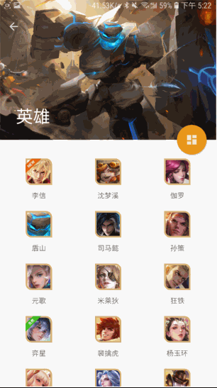
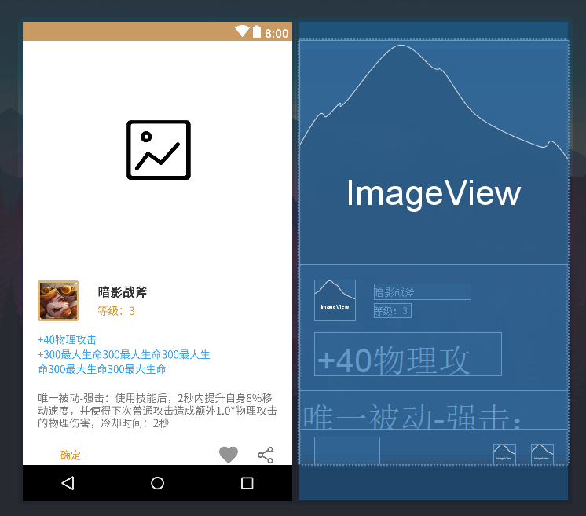
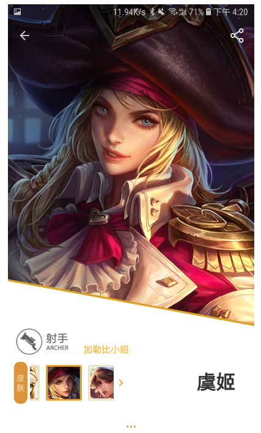
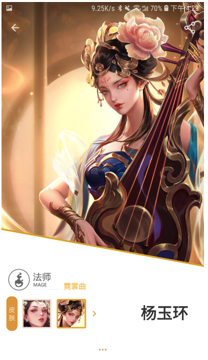

# 中山大学数据科学与计算机学院本科生实验报告

## （2018年秋季学期）

| 课程名称 | 手机平台应用开发 |   任课老师   |   郑贵锋    |
| :------: | :--------------: | :----------: | :---------: |
|   年级   |       大三       | 专业（方向） |  软件工程   |
|   学号   |     16340027     |     姓名     |   陈荣真    |
|   电话   |   18823066231    |    Email     | a@zhenly.cn |
| 开始日期 |    2018/11/4     |   完成日期   | 2018/11/24  |

------

## 一、实验题目

期中项目 -  王者荣耀英雄大全

## 二、实现内容

- 一个包括王者荣耀英雄人物头像、称号、名字、位置、生存能力值、攻击伤害值、技能效果值、上手难度值等信息的APP
- 具体细节可以参考<http://pvp.qq.com/web201605/herolist.shtml>

## 三、课堂实验结果

无

## 四、课后实验结果

### (1)实验截图、实验步骤以及关键代码


## 项目架构

由于这是一个比较完整的一个项目，因此在开发之前，就需要定下明确的架构方案。

在本次项目中，我们参考的是`Android Architecture Components   `，是谷歌在Google I/O 2017发布一套帮助开发者解决Android架构设计的方案，也是这是谷歌官方指南中推荐的架构。

这个架构由负责生命周期的`Lifecycle`和数据库的`Room`等组件组成，我们的架构在这里使用了`ObjectBox`代替了`Room`，并且使用了`Retrofit`来处理网络数据，使用`Dagger2`来实现依赖注入。

整体架构图：


项目结构：

```bash
.                                              
├── App.java                                   
├── data                                       
│   ├── common                                 
│   │   ├── ApiResponse.java                   
│   │   ├── AppExecutors.java                  
│   │   ├── JsoupResponse.java                 
│   │   ├── NetworkBoundJsoupResource.java     
│   │   ├── NetworkBoundResource.java          
│   │   ├── Resource.java                      
│   │   └── converter                          
│   │       ├── BitmapConverterFactory.java    
│   │       ├── CollectionTypeConverter.java   
│   │       ├── LiveDataCallAdapterFactory.java
│   │       ├── PayTypeAdapter.java            
│   │       ├── RelationListConverter.java     
│   │       ├── SkillListConverter.java        
│   │       └── TimestampConverter.java        
│   ├── model                                  
│   │   ├── CollectionItem.java                
│   │   ├── HeroDetailItem.java                
│   │   ├── HeroListItem.java                  
│   │   ├── InscriptionItem.java               
│   │   ├── ItemItem.java                      
│   │   ├── ListItem.java                      
│   │   ├── SearchItem.java                    
│   │   ├── SummonerItem.java                  
│   │   └── apimodel                           
│   │       ├── ApiHeroListItem.java           
│   │       ├── ApiInscriptionItem.java        
│   │       ├── ApiNormalItemItem.java         
│   │       └── ApiSpecialItemList.java        
│   ├── repository                             
│   │   ├── CollectionRepository.java          
│   │   ├── HeroRepository.java                
│   │   ├── InscriptionRepository.java         
│   │   ├── ItemRepository.java                
│   │   └── SummonerRepository.java            
│   └── service                                
│       ├── DataApiService.java                
│       ├── DataHtmlService.java               
│       ├── DatabaseService.java               
│       ├── ImageApiService.java               
│       └── ImageStorageService.java           
├── inject                              
│   ├── AppInjector.java                       
│   ├── Injectable.java                        
│   ├── component                              
│   │   └── AppComponent.java                  
│   ├── key                                    
│   │   └── ViewModelKey.java                  
│   └── module                                 
│       ├── ServiceModule.java                 
│       └── ViewModelModule.java               
├── receiver                                   
│   └── SearchWidget.java                      
└── ui                                         
    ├── activity                               
    │   ├── collection                         
    │   │   ├── CollectionActivity.java        
    │   │   ├── CollectionAdapter.java         
    │   │   └── CollectionHandler.java         
    │   ├── herodetail                         
    │   │   ├── HeroDetailActivity.java        
    │   │   ├── HeroDetailAdapter.java         
    │   │   ├── HeroDetailHandler.java         
    │   │   └── SkinAdapter.java               
    │   ├── list                               
    │   │   ├── ListActivity.java              
    │   │   ├── ListAdapter.java               
    │   │   ├── ListHandler.java               
    │   │   ├── ListHeroHandler.java           
    │   │   ├── ListItemHandler.java           
    │   │   ├── ListSkillHandler.java          
    │   │   └── ListTypeHandler.java           
    │   ├── menu                               
    │   │   ├── MenuActivity.java              
    │   │   └── MenuHandler.java               
    │   └── search                             
    │       ├── MaterialSearchView.java        
    │       ├── SearchActivity.java            
    │       ├── SearchAdapter.java             
    │       ├── SearchHandler.java             
    │       └── SearchListAdapter.java         
    ├── common                                 
    │   ├── ViewModel.java                     
    │   └── ViewModelFactory.java              
    └── fragment                               
        ├── card                               
        │   ├── CardFragment.java              
        │   └── CardHandler.java               
        ├── detail                             
        │   ├── DetailFragmentAdapter.java     
        │   ├── EquipmentFragment.java         
        │   ├── EquipmentHandler.java          
        │   ├── IntroductionFragment.java      
        │   ├── IntroductionHandler.java       
        │   ├── SkillFragment.java             
        │   └── SkillHandler.java              
        ├── loading                            
        │   └── LoadingFramgment.java          
        ├── note                               
        │   └── NoteFragment.java              
        └── sheet                              
            ├── HeroSheetFragment.java         
            └── ItemSheetFragment.java         
```


## UI 与 交互

我在这个项目里面主要负责是**UI的设计和布局**以及**交互逻辑的处理**。

### 设计准备

一款应用，UI是用户感受最直观的东西，UI的好坏决定了用户对这个应用的第一印象，是一个应用中仅次于功能的重要部分。而应用的交互逻辑直接决定了用户的使用体验，因此这一部分也同样重要。


#### 页面

因此，在布局之前先做一个大概的设计初稿是十分有必要的，有了基本的布局和架构，才能更方便设计和延伸细节

最初版设计图：


#### 颜色

为了统一UI，主题色也是十分重要的，因此还需要找出最适合应用主题的颜色，最后我们定下了以褐色和黄色为主题（取自于王者荣耀LOGO颜色），整个应用以浅色为主。

颜色设计图（最后选择了最后一种）：


#### 风格

本项目基本上遵循了`Google`的`Material Design`设计规范，使用到不少`Android Material Component`中提供的控件，尽可能和Android和风格融合在一起。


### 界面

这个应用是一个内容型的应用，如何把内容展示出来是一个十分重要的问题。

这里一共把界面分成五大部分：

- 主菜单
  - 用户进入应用的界面，也是用户选择查看内容的入口。必须要简明地展示出应用存在哪些内容，有哪些功能

- 搜索
  - 综合应用的所有内容，如果说主菜单是一个大分类的入口，那么搜索就是一个统一的入口，可以一步到位找到需要查找的内容。
- 列表（英雄、装备、技能）
  - 列表主要分成三大类，和官网的资料站提供的资料一致，而列表里面也可以对内容进行筛选。
- 收藏
  - 用户收藏关注的内容，在收藏中用户可以添加自己的备注（因为我们的应用的资源全部都来自官方网站的API，不可能实现增加或者删除英雄，只好做一个可以增删改的收藏）
- 英雄详情
  - 装备和技能由于内容比较少，使用弹出窗口来展示内容。而英雄详情的数据就需要一个专门的界面来展示了。


#### 主菜单

主菜单总体使用约束布局`ConstraintLayout`。

**顶部**的的`Logo`是一张`SVG`图片，然后使用`drawable`中的`shape`和`gradient`画出了一个渐变的背景

```xml
<?xml version="1.0" encoding="utf-8"?>
<shape xmlns:android="http://schemas.android.com/apk/res/android">
    <gradient
        android:angle="90"
        android:endColor="#c89a61"
        android:startColor="#ebcd96" />
</shape>
```

由于**菜单项目**比较少，而且考虑到自定义性比较高，因此直接根据约束进行布局，并没有使用`ListView`。

点击不同的菜单跳转到不同的页面。

约束布局可以很好地保证在不同分辨率的设备上，都可以保持大概的布局而不发生改变。事实上这里的菜单项也会根据屏幕的大小自适应地调整之间的间距。

而搜索框看上去是一个`EditText`，但实际上是一个带`Icon`的`MaterialButton`。点击后会跳转到搜索界面。

布局：


最终实际效果：


#### 搜索

搜索这里主要使用到一个`MaterialSearchView`的控件，但是这个库的实现说暴露的接口比较少，无法高度定制，不能满足我们原来的设计需求。因此我们修改了他的部分源码，加上了我们所需要的功能。

首先是加入了默认的搜索选项和历史记录，这个是他原来没有提供的。

然后对于不同的搜索结果，根据他们的类型展示不同的图标。


这个提示列表本质上就是一个`ListView`。因此，修改他原来的`adapter`就可以实现我们自定义的功能。

然后中间是一个提示的文字，显示一些提示信息（如无搜索结果）

搜索结果使用`RecyclerView`实现

右边的标签表示了他们的不同的属性。


应用界面的数据都是来自一个统一的`ViewModel`，从这个`ViewModel`中我们可以获取所有的数据。但是这些数据是从三个不同的数据库中获取的，因此需要查遍三个数据库，把和关键词有关的项加入数据源中，展示出来。

他们的点击事件，则调用其他页面现成的函数，对于装备和技能就直接用对话框展示出来，对于英雄则跳转到详情界面


布局：


#### 列表

列表是这个应用最核心的一个界面，因为很多内容都依赖于列表来展示。

##### 布局复用

这个列表页面时重复使用在三个地方：英雄列表，装备列表和技能列表。

在这个`Activity`加载的时候，根据`Intent`中的参数展示不同的内容

```java
ListHandler(ListActivity activity, ListActivityBinding binding, int type) {
  AppInjector.inject(this);
  this.activity = activity;
  this.binding = binding;
  this.type = type;
  ViewModel viewModel = ViewModelProviders.of(activity, viewModelFactory).get(ViewModel.class);
  if (type == 1) {
    this.typeHandler = new ListItemHandler(activity, binding, viewModel);
  } else if (type == 2) {
    this.typeHandler = new ListSkillHandler(activity, binding, viewModel);
  } else {
    this.typeHandler = new ListHeroHandler(activity, binding, viewModel);
  }
  typeHandler.initList();
  initView();
}
```


虽然则三个页面使用的都是同一个布局，但是他们的数据和部分逻辑是单独的，因此我设计了一个接口

```java
public interface ListTypeHandler {
    void initList(); // 初始化列表数据
    void initView(); // 初始化视图
    void onClickFilter(); // 筛选按钮点击事件
    void onRefresh(RefreshLayout refreshLayout); // 刷新列表事件
}
```

然后把他们了不同的逻辑写在不同的`Handler`里面


最终由`ListHandler`负责共同部分逻辑的界面的处理，然后调用他们单独的`Handler`实现来展示不同的内容 。


对于列表，由于三种界面的数据是不一样的，因此如果想要使用同一个`Adapter`的话，必须具有一种统一的数据结构，这里同样也使用了接口

```java
public interface ListItem {
    int getId();
    String getName();
}
```

由于列表的显示需要显示图片和名字，图片可以根据ID从	`ViewModel`中获取，而所有的`Item`都可以获取其`id`和名字`name`，因此使用了接口实现。


```java
void addData(List<? extends ListItem> item) {
    int oldSize = this.data.size();
    this.data.addAll(item);
    notifyItemRangeInserted(oldSize, this.data.size());
}
```

然后`Adapter`的函数就需要`List<? extends ListItem>`类型的参数，可以接受一切实现了`ListItem`接口的`List`数据。

在`bind`的时候就可以根据

```java
if (item instanceof HeroListItem) {
...
}
```

来判断具体的类型再做进一步的细化操作。


##### 可收缩标题栏

列表的顶端使用了`Android Material Component`中的`CollapsingToolbarLayout`。

这个控件具有两种形态：

在展开形态，标题默认显示在图片的左下角

在收缩形态，标题显示在标题栏上

而这两个形态之间，标题的颜色、大小和位置会随着用户的滑动而进行过渡。

其基本的使用方法如下：

```xml
    <android.support.design.widget.CoordinatorLayout
        android:layout_width="match_parent"
        android:layout_height="match_parent"
        android:fitsSystemWindows="true">

        <android.support.design.widget.AppBarLayout
            android:id="@+id/list_appbar"
            android:layout_width="match_parent"
            android:layout_height="265dp"
            android:fitsSystemWindows="true">

            <android.support.design.widget.CollapsingToolbarLayout
                android:id="@+id/list_collapsing_toolbar"
                android:layout_width="match_parent"
                android:layout_height="match_parent"
                android:fitsSystemWindows="true"
                android:theme="@style/ThemeOverlay.AppCompat.Dark.ActionBar"
                app:contentScrim="?attr/colorPrimaryDark"
                app:layout_scrollFlags="scroll|exitUntilCollapsed">

                <ImageView
                    android:id="@+id/list_top_img"
                    android:layout_width="match_parent"
                    android:layout_height="match_parent"
                    android:fitsSystemWindows="true"
                    android:scaleType="centerCrop"
                    android:src="@mipmap/list_hero_bg"
                    app:layout_collapseMode="parallax"
                    app:layout_collapseParallaxMultiplier="0.6" />

                <android.support.v7.widget.Toolbar
                    android:id="@+id/list_toolbar"
                    android:layout_width="match_parent"
                    android:layout_height="?attr/actionBarSize"
                    app:layout_collapseMode="pin"
                    app:navigationIcon="@drawable/ic_arrow_back_white_24dp"
                    app:popupTheme="@style/ThemeOverlay.AppCompat.Light"
                    app:theme="@style/ThemeOverlay.AppCompat.Dark.ActionBar" />

            </android.support.design.widget.CollapsingToolbarLayout>
        </android.support.design.widget.AppBarLayout>

        <com.scwang.smartrefresh.layout.SmartRefreshLayout
            android:id="@+id/refresh_layout"
            android:layout_width="match_parent"
            android:layout_height="match_parent"
            android:addStatesFromChildren="true"
            app:layout_behavior="@string/appbar_scrolling_view_behavior">

            <android.support.v7.widget.RecyclerView
                android:id="@+id/list_recycler"
                android:layout_width="match_parent"
                android:layout_height="match_parent"
                android:paddingHorizontal="10dp"
                android:paddingTop="25dp"
                app:layout_behavior="@string/appbar_scrolling_view_behavior" />

        </com.scwang.smartrefresh.layout.SmartRefreshLayout>
    </android.support.design.widget.CoordinatorLayout>
```

外部是一个`CoordinatorLayout`是一个作为协调子 View 之间交互的容器。

使用这个控件，可以实现不同层面的视差滚动效果，只需要设置`CollapsingToolbarLayout`里面的元素的`layout_collapseMode`为`parallax`，就可以实现视差效果。具体来说就是图片的滚动和其他内容（如列表）的滚动速度不一致，我这里把视差滚动的因子调成`0.6`，在实际上可以看到图片的滚动比列表要慢上一些，有一种图片在比较远的位置，有深度的效果。

动态效果：



这个有一个需要主要的点就是我们需要把响应滚动事件的控件（如下面的RecyclerView）

加上`app:layout_behavior="@string/appbar_scrolling_view_behavior"`这个属性，不然只能按着上面的标题栏进行滚动，交互效果就差上了很多。

细心的朋友可能会发现，当状态栏处于收缩状态的时候，浮动按钮消失了，而菜单出现了。这是通过监听`AppBar`的滚动事件实现的，对完全收缩、完成展开、中间部分三个阶段对于控件可见属性设置。

```java
binding.listAppbar.addOnOffsetChangedListener((appBarLayout, verticalOffset) -> {
  if (Math.abs(verticalOffset) == appBarLayout.getTotalScrollRange()) {
    if (menuItem != null) menuItem.setVisible(true);
    // Collapsed (make button visible and fab invisible)
  } else if (verticalOffset == 0) {
    binding.listToolbar.showOverflowMenu();
    if (menuItem != null) menuItem.setVisible(false);
    // Expanded (make fab visible and toolbar button invisible)
  } else {
    if (menuItem != null) menuItem.setVisible(false);
    // Somewhere in between
  }
});
```

至于`menuItem`的设置，也就是菜单栏的设置，可以在`Activity`里重写`onCreateOptionsMenu`函数创建

```java
@Override
public boolean onCreateOptionsMenu(Menu menu) {
  getMenuInflater().inflate(R.menu.toolbar_menu, menu);
  MenuItem menuItem = menu.findItem(R.id.menu_item_filter);
  handler.setMenuItem(menuItem);
  return super.onCreateOptionsMenu(menu);
}
```

在`res`的`menu`中创建一个`xml`描述菜单项

```xml
<?xml version="1.0" encoding="utf-8"?>
<menu xmlns:android="http://schemas.android.com/apk/res/android"
    xmlns:app="http://schemas.android.com/apk/res-auto">
<item android:id="@+id/menu_item_filter"
    android:icon="@drawable/ic_dashboard_black_24dp"
    app:showAsAction="always"
    android:visible="false"
    android:title="@string/menu_item_filter" />
</menu>
```


##### 适配状态栏

由于这个界面的顶部是图片，因此，如果状态栏还是一条色块就会显示得很难看。因此这里加入了状态栏的适配。

首先创建一个`sytle`

```xml
<style name="TransBar" parent="AppTheme">
  <item name="android:statusBarColor">@android:color/transparent</item>
</style>
```

加入到`AndroidMainfest.xml`指定的`activity`里面

```xml
<activity
          android:name=".ui.activity.list.ListActivity"
          android:theme="@style/TransBar" />
```

然后对于延伸到状态栏上面的控件，需要一层一层在布局加入` android:fitsSystemWindows="true"`这个属性。

上面的布局代码可以看到，从`CoordinatorLayout`一直到`ImageView`，都加上了这个属性。


##### 下拉刷新

对于英雄列表，我们还实现了下拉刷新。因为数据都是来自于网络的，第一次访问会检查本地数据库是否存在数据，如果不存在则从使用API获取，如果本地存在则直接从本地获取，而本地的数据会在一定时候后过期。那么如果用户想要获取最新的数据就需要手动进行刷新。

拖住列表向下拉就可以手动刷新

这里主要使用了一个`SmartRefreshLayout`的控件，直接包在`RecyclerView`外部，就可以实现下拉刷新效果，使用起来极其简单。

效果图：


##### 列表动画

对于`RecyclerView`的动画效果，这里使用了`recyclerview-animators`这个库

使用起来也非常简单：

```java
// 列表动画
SlideInLeftAnimator slideInLeftAnimator = new SlideInLeftAnimator();
slideInLeftAnimator.setAddDuration(300);
binding.listRecycler.setItemAnimator(slideInLeftAnimator);
// adapter动画
adapter = new ListAdapter(activity, viewModel, 0);
adapter.setListener(this);
binding.listRecycler.setAdapter(new AlphaInAnimationAdapter(adapter));
binding.listRecycler.setLayoutManager(new GridLayoutManager(activity, 3));
```

上面的动画可以给每个具体的`Item`的进入和离开设置动画，下面的动画可以给没有加载的`Item`设置加载动画，比如向下滑动的时候就会显示。

需要注意的是，这些动画必须和`RecyclerView.Adapter`中的 `notify`等函数配合使用，通知那些数据被添加或者删除，动画才会显示出来。

比如刷新数据

```java
// 刷新数据
void refreshData(List<? extends ListItem> data) {
  if (data == null) return;
  this.notifyItemRangeRemoved(0, this.data.size());
  this.data.clear();
  this.data.addAll(data);
  this.notifyItemRangeInserted(0, this.data.size());
}
```


##### 筛选

英雄和装备都实现了各自的筛选功能，通过接口由`ListHandler`统一调用。

筛选是通过`BottomSheetDialogFragment`实现的，也是`Material Design`中的一个控件，其本质就是一个`DialogFragment`，只不过是从界面的底部弹出，并且具有默认动画效果。

```java
this.sheet = new ItemSheetFragment((sheetBinding) -> {
  this.sheetBinding = sheetBinding;
  this.sheetBinding.setHandler(this);
  setSortClassView(this.sortClass);
  setBtnBackgroundTint(this.sort);
});
this.sheet.show(activity.getSupportFragmentManager(), "ItemBottomSort");
```

其用法和`DialogFragment`一样，通过`show`方法显示。

英雄的筛选分为8大类，而装备的筛选分为10大类


对于选中的部分，筛选界面会高亮显示


这里的分类标志是从官方资料站上面下载下来的一张图片，我们通过设置颜色滤镜，使用`SRC_ATOP`模式在原来的颜色上面叠加上主题颜色，通过`setColorFilter`使其显示高亮状态

```java
private void setImageFilter(int sort) {
  ImageView images[] = {sheetBinding.sheetSort1, sheetBinding.sheetSort2, sheetBinding.sheetSort3,sheetBinding.sheetSort4, sheetBinding.sheetSort5, sheetBinding.sheetSort6};
  for (ImageView image : images) {
    if (sort == image.getId()) {
      image.setColorFilter(activity.getColor(R.color.colorPrimaryDark), PorterDuff.Mode.SRC_ATOP);
    } else {
      image.clearColorFilter();
    }
  }
}
```

筛选的本身就是一个过滤的过程，将从`ViewMode`获取的所有数据的类型属性和当前类型做对比，如果符合就加入`RecyclerView`的数据源当中。

```java
binding.listCollapsingToolbar.setTitle(title + "装备");
viewModel.getNormalItemList().observe(activity, resource -> {
  if (resource != null && resource.data != null && resource.status == Resource.Status.SUCCESS) {
    if (title.equals("常规")) {
      this.adapter.refreshData(resource.data);
    } else {
      List<ListItem> data = new ArrayList<>();
      for (ItemItem item : resource.data) {
        if (title.equals(item.getType())) {
          data.add(item);
        }
      }
      this.adapter.refreshData(data);
    }
    this.sheet.dismiss();
  }
});
```


布局：


##### 弹出窗口

由于装备和技能的内容比较少，因此没有必要为他们专门装备一个界面，只需要一个`DialogFragment`就足够了。

装备：


召唤师技能：


这两个弹出窗口使用的都是同一个布局，而且都是`DialogFragment`实现的，而且都实现了一个静态的方法，在任何界面只需要传入数据就可以显示出这个弹出窗口。

他们的布局也比较简单，最外面一层`MaterialCardView`，用于实现卡片的显示效果，是`Material Design`的一个控件。通过设置不同控件（如图片、金钱）的可见性来呈现不同的显示效果。

布局：



调用方法：

```java
final CardFragment fragment = new CardFragment(activity);
final ItemCardBinding itemBinding = fragment.getBinding();
// ... 处理界面和事件
fragment.show(activity.getSupportFragmentManager(), "ItemDetail");
```

只需要生成一个`Fragment`实例，然后通过`FragmentManager`调用他的`show`方法就可以显示出来。


由于直接弹出框会显得特别生硬，因此我们可以为他加入一些动画。

首先在`value`-`anim`下使用`xml`编写进入和退出的动画

```xml
<!-- in -->
<?xml version="1.0" encoding="utf-8"?>
<set xmlns:android="http://schemas.android.com/apk/res/android">
    <scale
        android:fromXScale="0.0"
        android:toXScale="1.0"
        android:fromYScale="0.0"
        android:toYScale="1.0"
        android:pivotX="65%"
        android:pivotY="65%"
        android:duration="400"/>

    <alpha
        android:duration="400"
        android:fromAlpha="0.8"
        android:toAlpha="1.0" />
</set>
<!-- out -->
<?xml version="1.0" encoding="utf-8"?>
<set xmlns:android="http://schemas.android.com/apk/res/android">
    <scale
        android:fromXScale="1.0"
        android:toXScale="0.0"
        android:fromYScale="1.0"
        android:toYScale="0.0"
        android:pivotX="65%"
        android:pivotY="65%"
        android:duration="400"/>

    <alpha
        android:duration="400"
        android:fromAlpha="1.0"
        android:toAlpha="0.2" />
</set>
```

这里我使用的是缩放的动画，然后添加到里面

```java
@Override
public void onActivityCreated(Bundle arg0) {
  super.onActivityCreated(arg0);
  Objects.requireNonNull(getDialog().getWindow()).getAttributes().windowAnimations = R.style.DialogAnimation;
}
```

只需要在`DialogFragment`创建的时候指定窗口的动画即可

动画效果：


#### 收藏

收藏的布局和列表差别不大，都是采用同样的结构，保持二级界面的UI的统一性。

##### 侧滑列表项

需要特别关注的是这里的收藏的数据采用了`LiveDate<>`作为数据源，会在数据发生变化的时候通知订阅者，是一个简化版的`RxJava`.当收藏发生变化的时候，就会通知列表对数据进行更新。

这里使用到一个比较特殊的控件就是`SwipeLayout`，是一个可以左右滑动的控件：


通过左右滑动可以显示不同的界面，在这里这两个界面是两个按钮。向左滑动可以调出添加/修改备注的功能，向右滑动可以调出删除收藏的按钮。

使用起来也不难，首先是布局

```xml
<com.daimajia.swipe.SwipeLayout
		android:id="@+id/collection_swipe"
		android:layout_width="match_parent"
		android:layout_height="wrap_content">
  <!-- Bottom View Start-->
  <include android:id="@+id/collection_bottom_left"
           layout="@layout/collection_item_left"/>
  <include  android:id="@+id/collection_bottom_right"
           layout="@layout/collection_item_right"/>
  <!-- Bottom View End-->
  <!-- Surface View Start -->
  <LinearLayout
                android:id="@+id/collection_surface_layout"
                android:layout_width="match_parent"
                android:layout_height="match_parent">
    <include
             android:id="@+id/collection_surface"
             layout="@layout/list_item_card" />
  </LinearLayout>
  <!-- Surface View End -->
</com.daimajia.swipe.SwipeLayout>
```

`SwipLayout`会将其最右一个子布局作为顶层布局显示，而上面的所有子布局都会被当作底层布局。

由于这个布局是`RecyclerView`的`Item`的布局，因此需要在`Adapter`里面设置他们的属性

```java
binding.collectionSwipe.setShowMode(SwipeLayout.ShowMode.PullOut);
binding.collectionSwipe.addDrag(SwipeLayout.DragEdge.Left, binding.collectionBottomLeft.collectionLayoutLeft);
binding.collectionSwipe.addDrag(SwipeLayout.DragEdge.Right, binding.collectionBottomRight.collectionLayoutRight);
```

只需要指定滑动的模式（拖动或者抽屉），然后指定左边拖动的布局以及右边拖动的布局，就可以实现一个可以左右侧滑的列表项了。

实际效果：


布局：


#### 英雄详情

##### GIF加载动画

由于英雄详情的首次进入需要加载的数据比较多（尤其是高清皮肤图），根据不同的网络状态，大概需要2-3s以上的事件加载（再次进入会检查本地缓存和数据库）

因此加入了一个加载的过渡动画


这个动画是一个`Gif`，由于原生的`ImageView`不支持直接设置`Gif`，因此这里使用了一个`android-gif-drawable`的控件，实际上的使用方法和`ImageView`是一模一样的。

```xml
    <pl.droidsonroids.gif.GifImageView
        android:id="@+id/loading_gif"
        android:layout_width="wrap_content"
        android:layout_height="wrap_content"
        android:layout_marginStart="8dp"
        android:layout_marginEnd="8dp"
        android:src="@mipmap/loading"
        app:layout_constraintBottom_toBottomOf="parent"
        app:layout_constraintEnd_toEndOf="parent"
        app:layout_constraintStart_toStartOf="parent"
        app:layout_constraintTop_toTopOf="parent" />
```

##### 布局


这里的布局看上去只是一张图片，加一些控件，但实际上还是一个`CollapsingToolbarLayout`，只不过我把它的高度调成了全屏，然后把标题的位置调成右下角，颜色调成黑色。

而这条斜线是通过`drawable`画出来的。`Drawable`本身并没有提供可画出斜线或者三角形的东西，因此这里需要用到一个特别的思路

```xml
<?xml version="1.0" encoding="utf-8"?>
<rotate xmlns:android="http://schemas.android.com/apk/res/android"
    android:fromDegrees="-70"
    android:pivotX="90%"
    android:pivotY="85%"
    android:toDegrees="45">
    <shape android:shape="rectangle">
        <solid android:color="#ffffff" />
        <stroke
            android:width="3dp"
            android:color="#d7a124" />
    </shape>
</rotate>
```

这里首先通过`shape`画了一个带边框的白色矩形，然后使用`rotate`对其进行旋转，使其一条边显示倾斜显示并且下移和右移一定的百分比。

```xml
<ImageView
           android:scaleX="2"
           android:layout_width="match_parent"
           android:layout_height="match_parent"
           android:layout_marginBottom="55dp"
           android:layout_gravity="bottom"
           android:src="@drawable/triangle_bg"
           app:layout_collapseMode="parallax"
           app:layout_collapseParallaxMultiplier="0.4" />
```

然后在布局的时候，对其X轴进行2倍的缩放。最后就会显示成斜线的一个显示效果。

然后为这个斜线和背景图片分别设置不同因子的视差效果，就会得到十分有趣的效果：


##### 图片滚动

再看看上上张图，可以发现图片显示不完全，只能显示英雄的半张脸。由于图片都是横向的，而我们的可视窗口是竖向的，因此图片高度越大就越难显示全部内容。

因此需要一种方案展示全部图片。

我们这里采取的方案是使得图片可以左右滑动，让用户滑动到想要的位置（然后就可以通过分享功能分享布局截图给小伙伴了）

```java
<HorizontalScrollView
    android:id="@+id/skin_scroll"
    android:layout_width="match_parent"
    android:layout_height="match_parent"
    android:layout_marginBottom="100dp"
    android:fitsSystemWindows="true"
    app:layout_collapseMode="parallax"
    android:fillViewport="true"
    app:layout_collapseParallaxMultiplier="0.6">
    <ImageView
        android:id="@+id/bg_skin"
        android:layout_width="wrap_content"
        android:layout_height="match_parent"
        android:adjustViewBounds="true"
        android:src="@mipmap/skin" />

</HorizontalScrollView>
```

实现起来也不难，只需要在图片的外层套一层`HoriazontalScrollView`

然后把其`android:fillViewport`设为`true`，图片的` android:adjustViewBounds`设为`true`，就可以实现手动左右滑动，甚至可以在代码里面控制图片的滚动。

这两个属性是十分重要的，如果没有这两个属性，图片就会默认以最长边进行适配，以显示全图，结果就是我们只看到图片在小小的上面，而不能放大。

加上了这两个属性，图片就可以适应滚动布局的高度而放大。

##### 皮肤切换

对于同一个英雄，会有不同的皮肤数量，有些甚至有5、6个皮肤。因此我们需要一个`RecyclerView`来供用户选择显示的图片。

对于对于两个皮肤的英雄，会给出一个箭头指示可滑动的`RecyclerView`




最终效果：



布局：


下面还有`TabLayout`、`ViewPager`等一些布局，不过这是另外一位队友做的，这里就不详细说明了。


## 数据

数据优先从本地缓存、数据库中获取，如果没有找到再从官方的API联网获取。这一部分的工作是由另一位大佬完成的，这里就不详细说明了，这里主要说一下前端界面和后端数据的交互方法。

### 数据绑定

DataBinding是`Android Architecture Components   `中推荐使用的一部分。

> DataBinding 是谷歌官方发布的一个框架，顾名思义即为数据绑定，是 MVVM 模式在 Android 上的一种实现，用于降低布局和逻辑的耦合性，使代码逻辑更加清晰。MVVM 相对于 MVP，其实就是将 Presenter 层替换成了 ViewModel 层。DataBinding 能够省去我们一直以来的 findViewById() 步骤，大量减少 Activity 内的代码，数据能够单向或双向绑定到 layout 文件中，有助于防止内存泄漏，而且能自动进行空检测以避免空指针异常

通过数据绑定，我们只需要在布局的时候，在`xml`里面指定控件所绑定的数据和事件。就可以将控件的`onClick`和`Handler`里面的函数对应起来，将控件的数据，如`src`,`text`和`model`里面的数据绑定起来，只需要通过`setModel`就可以设置所有的数据。

当然，这个东西并不是所有的东西都可以绑定的，不过也不要紧。通过布局文件生成的对应的`binding`类，可以直接访问里面所有具有`id`的控件，并且将下划线命名法自动转换成`Java`里面的驼峰命名风格的变量。

下面就是代码中使用`binding`直接操作控件的方法。

```java
// 设置颜色
binding.listCollapsingToolbar.setExpandedTitleColor(activity.getColor(R.color.colorText));
binding.listCollapsingToolbar.setCollapsedTitleTextColor(Color.WHITE);
// 设置导航栏
activity.setSupportActionBar(binding.listToolbar);
binding.listToolbar.setNavigationOnClickListener(v -> this.goBack());
```


### ViewModel

前端界面显示的所有数据都是在`Handler`层直接调用`ViewModel`获取的，而`ViewModel`则是通过`Dagger2`注入到各个`Handler`里面。

由于很多数据需要异步获取，因此`ViewModel`返回的数据都是`LiveData<>`，我们需要观察他们的变化对UI的内容进行填充

下面是使用`ViewModel`获取英雄列表的一个例子：

```java
viewModel.getHeroList().observe(activity, resource -> {
    if (resource != null) {
        switch (resource.status) {
            case LOADING:
                binding.loadingProgressbar.setVisibility(View.VISIBLE);
                binding.listNetworkError.setVisibility(View.GONE);
                break;
            case ERROR:
                if (resource.data == null || resource.data.size() == 0) {
                    binding.loadingProgressbar.setVisibility(View.GONE);
                    binding.listNetworkError.setVisibility(View.VISIBLE);
                    break;
                }
            case SUCCESS:
                binding.listNetworkError.setVisibility(View.GONE);
                binding.loadingProgressbar.setVisibility(View.GONE);
                adapter.addData(resource.data);
                break;
        }
    }
});
```

根据数据的变化的不同情况对于界面做出不同的反应，显示给用户。

当状态`LOADING`的时候，可以显示进度条，告诉用户需要等待。

当因为网络问题不能获取数据的时候，就会观测到`ERROR`状态，就可以将无法获取数据的提示展示给用户。

当状态为`SUCCESS`的时候，就可以将数据内容显示到界面。


### (2)实验遇到的困难以及解决思路

因为我在这个项目主要是负责界面的设计和交互逻辑的处理，在做这个项目时候，遇到了很多界面布局上的坑。

比如`CollapsingToolbarLayout`中标题收缩起来错位，`fitsSystemWindows`无效的情况。

解决方法：通过设置主题样式以及`setSupportActionBar`解决，上面过程中有提到了。


还有`DialogFragment`布局最外层布局的宽度`match_parent`的问题。

解决方法：使用`warp_conent`


还有`NestedScrollView`和`RecyclerView`在一起用造成的性能问题，使得`RecyclerView`一次性绑定过多`Item`，导致界面卡顿的问题。

解决方法：直接用`RecyclerView`作为外层布局


还有`MaterialButton`无法在代码中设置背景色，

解决方法：必须要使用`setBackgroundTintList`和`getColorStateList`才能才能设置的问题。

## 五、实验思考及感想

这次期中项目完完整整地实现了一个具有实际用途的应用，从中学到了不少。

首先是对于应用架构的搭建更加地得心应手了，基本上了解了一个Android应用的基本构成和工作原理。

然后使用了很多Android应用开发中比较流行的界面UI库以及架构库，使用了谷歌官方推荐的`MVVM`的架构来开发应用，对于各个布局做了解耦处理（虽然耦合度还是比较高，部分代码也是比较乱）。

这次项目遇到了一系列的坑，都通过`Google`以及个人经验逐一踩掉，总的来说在交互逻辑和布局上积累了不少的经验，在总体的应用架构设计上也有了方案。


