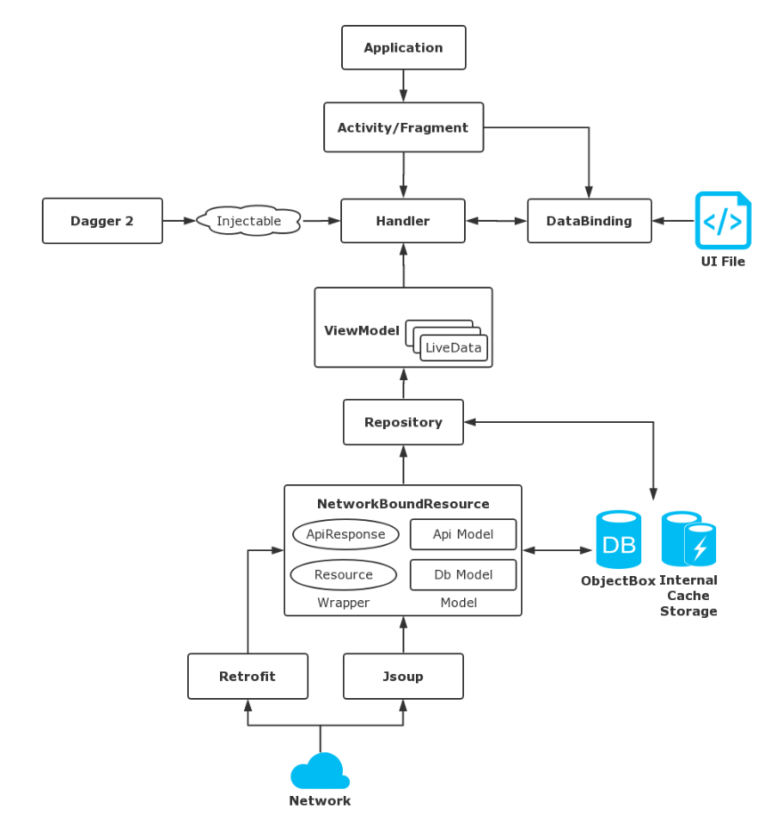
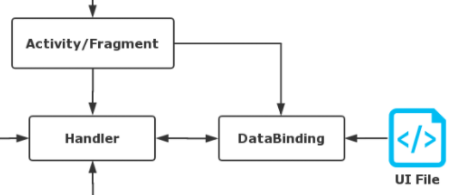
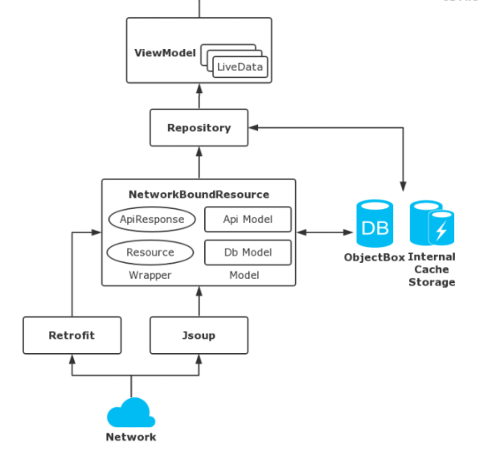
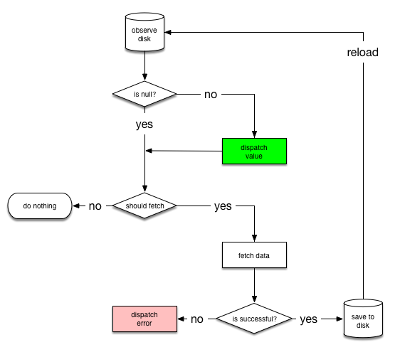
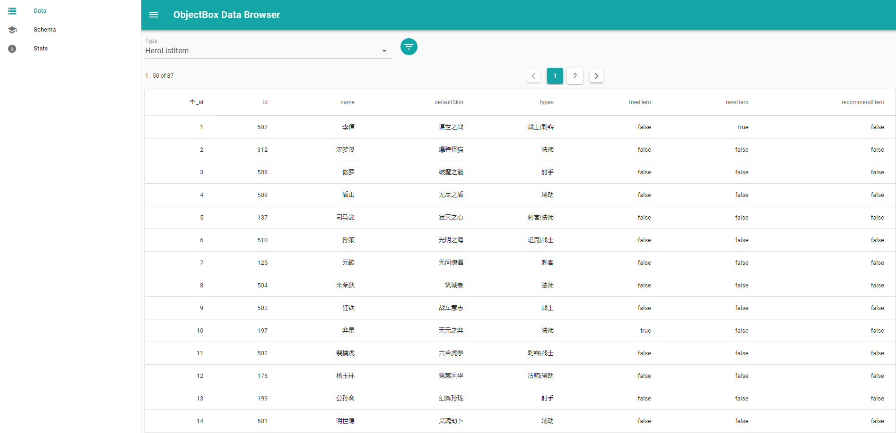

# 中山大学数据科学与计算机学院本科生实验报告
## （2018年秋季学期）
| 课程名称 | 手机平台应用开发 | 任课老师 | 郑贵锋 |
| :------------: | :-------------: | :------------: | :-------------: |
| 年级 | 16 | 专业（方向） | 软件工程(计算机应用) |
| 学号 | 16340040 | 姓名 | 陈秀嘉 |
| 电话 | 15766334896 | Email | megachan@foxmail.com |
| 开始日期 | 2018.11.4 | 完成日期 |2018.11.25|

---

## 一、实验题目

* 王者荣耀助手

## 二、实现内容

- 一个包括王者荣耀英雄人物头像、称号、名字、位置、生存能力值、攻击伤害值、技能效果值、上手难度值等信息的APP
- 具体细节可以参考<http://pvp.qq.com/web201605/herolist.shtml>

## 三、实验结果 [实验截图、步骤以及关键代码]
本人在本项目中，负责非UI类依赖库选择、架构搭建、数据获取。

### 技术栈选择

UI类依赖库由荣真负责选择和使用，非UI类依赖库由本人选择。

本项目采用了下列依赖库：

* `Android Architecture Component`：提供构成架构原型的各种组件。
* `Android DataBinding`：用于Activity与UI的数据绑定、方法绑定。
* `Dagger 2`：提供高效开发的依赖注入框架。
* `Jsoup`：解析HTML，提供灵活的HTML解析工具。
* `ObjectBox`：本地数据库。
* `Retrofit`：网络请求工具。
* `Timber`：日志工具，辅助DEBUG。

### 架构搭建

以下这张图为本项目的架构。



接下来我们来分析一下架构是如何设计、为什么这样设计以及关键代码。

#### UI模块

UI采用了`Android DataBinding`这款官方的UI数据绑定、方法绑定的依赖库，在UI框架中，因此有两个重要的类：`Activity`、`DataBinding`。



为了解耦与Activity相关的事件和UI层的事件，我们构建了一个新的类：`Handler`。这个类并不是Android多线程中的`Handler`类，它的主要功能是处理UI层的初始化事件，以及将本身通过数据绑定的形式绑定到UI上，并通过方法绑定的形式将自身的公有方法绑定到点击事件等事件上。

```java
public class MenuActivity extends AppCompatActivity {

    @Override
    protected void onCreate(@Nullable Bundle savedInstanceState) {
        super.onCreate(savedInstanceState);

        MenuActivityBinding binding = DataBindingUtil.setContentView(this, R.layout.menu_activity);
        binding.setHandler(new MenuHandler(this, binding));
    }
}
```

```java
public class MenuHandler {
    private MenuActivity activity;
    private MenuActivityBinding binding;

    MenuHandler(MenuActivity activity, MenuActivityBinding binding) {
        this.activity = activity;
        this.binding = binding;
    }

    public void onClickList(View view) {
        ListActivity.startActivity(activity, view.getId());
    }
}

```

```xml
<?xml version="1.0" encoding="utf-8"?>
<layout xmlns:android="http://schemas.android.com/apk/res/android"
    xmlns:app="http://schemas.android.com/apk/res-auto">
    <data>
        <variable
            name="handler"
            type="studio.xmatrix.qqpvp.assistant.ui.activity.menu.MenuHandler" />
    </data>
    <android.support.constraint.ConstraintLayout
        android:layout_width="match_parent"
        android:layout_height="match_parent"
        android:background="@color/colorMenuBackground">
        <ImageView
            android:id="@+id/menu_hero"
            android:onClick="@{handler::onClickList}"/>
    </android.support.constraint.ConstraintLayout>
</layout>
```

上述三段代码是`ui.activity.menu`包中的代码删去无关部分构成，这是一个简化的Activity - Handler - DataBinding架构。

UI模块虽然采用了Android DataBinding，但是通过Handler来分割Activity事件和UI事件，是参考[ConnorLin/DataBindingDemo](https://github.com/ConnorLin/DataBindingDemo)所设计的。

#### Inject模块

使用依赖注入框架并不是项目一开始就引入的，而是Data模块实在太复杂了，每次修改一个Repository的构造函数时，都要一层层修改多个地方，于是引入Dagger 2负责依赖注入和单例模式。

本项目依赖注入的最顶层并不跟其他Android项目一样以Activity作为顶层，而是将Handler视作顶层依赖注入。这样就导致了无法使用Dagger 2关于Android的扩展库，而是要自己手动配置注入。

```java
public interface Injectable {}
```

我们创建一个空的接口，每个继承这个接口的类的对象都被视作为依赖注入的实例。

```java
public class AppInjector {

    private AppInjector() {}

    private static AppComponent component;

    public static void init(App app) {
        component = DaggerAppComponent.builder().app(app).build();
    }

    public static void inject(Injectable injectable) {
        if (injectable instanceof ListHandler) {
            component.inject((ListHandler) injectable);
        } else if (injectable instanceof SearchHandler) {
            component.inject((SearchHandler) injectable);
        } else if (injectable instanceof CollectionHandler) {
            component.inject((CollectionHandler) injectable);
        } else if (injectable instanceof HeroDetailHandler) {
            component.inject((HeroDetailHandler) injectable);
        } else {
            throw new IllegalArgumentException("Class not found in AppComponent");
        }
    }
}
```

我们将依赖注入的过程封装为`init`和`inject`两个过程，其中初始化在Application中实现，而注入在每个注入实例对应的类的构造函数中注入。由于依赖注入不具有继承性，我们只能通过暴力列举类的方式实现。这里的暴力，是为了简化在Handler中的代码理解。因此，在依赖注入的组件中，我们依然需要暴力列举各种类的注入方法。

```java
public interface AppComponent {
    void inject(ListHandler handler);
    void inject(SearchHandler handler);
    void inject(CollectionHandler handler);
    void inject(HeroDetailHandler handler);
}
```

此时，在Handler中，我们只需要简单的注入。

```java
public class ListHandler implements Injectable {

    @Inject
    ViewModelProvider.Factory viewModelFactory;

    ListHandler() {
        AppInjector.inject(this);
    }
}
```

#### Data模块

Data模块比较复杂，其主要的功能是给Handler提供数据。Data模块居然分为下面几个组件：

* `ViewModel`：由Handler直接交互，是Handler获取数据的接口。
* `Repository`：向`ViewModel`提供数据，只负责提供数据，内部隐藏了数据来源信息，根据不同的情况从不同来源中获取数据。
* `Service`：向`Repository`提供数据，从某个数据来源中获取数据的接口。一般而言，`Repository`中引用了多个`Service`，比如Database Service、Network Service。
* `Model`：数据操作的类型。



不过，这里涉及到了一个更加复杂的组件：`NetworkBoundResource`。这是一个离线缓存的工具类，提供了离线获取数据的功能。以下为NBR的决策树。



简单地说，就是它首先调用`loadFromDb`方法从本地数据库中获取数据。获取到数据之后，通过`shouldFetch`方法判断是否需要从云端拉取最新的数据。如果不需要拉取，那就将数据返回到前端；如果需要拉取，就调用`createCall`方法从互联网中拉取最新的数据，然后通过`saveCallResult`方法将数据存储到本地数据库中。最后再调用`loadFromDb`方法从本地数据库中获取数据，将数据返回到前端。

首先，我们实现获取英雄列表的Service。

```java
@Singleton
public interface DataApiService {

    String BASE_URL = "http://pvp.qq.com/";

    @GET("web201605/js/herolist.json")
    LiveData<ApiResponse<List<ApiHeroListItem>>> getHeroList();
}
```

```java
@Singleton
public class DatabaseService {
    public LiveData<List<HeroListItem>> getHeroList() {
        MutableLiveData<List<HeroListItem>> data = new MutableLiveData<>();
        executors.diskIO().execute(() ->
                data.postValue(app.getBoxStore().boxFor(HeroListItem.class).getAll())
        );
        return data;
    }

    public void setHeroList(List<HeroListItem> heroes) {
        app.getBoxStore().boxFor(HeroListItem.class).removeAll();
        app.getBoxStore().boxFor(HeroListItem.class).put(heroes);
    }
}
```

然后构建一个Repository，管理这两个Service。

```java
@Singleton
public class HeroRepository {
    public LiveData<Resource<List<HeroListItem>>> getHeroList() {
        return new NetworkBoundResource<List<HeroListItem>, List<ApiHeroListItem>>(executors) {
            @Override
            protected void saveCallResult(@NonNull List<ApiHeroListItem> items) {
                List<HeroListItem> newItems = new ArrayList<>();
                for (ApiHeroListItem item : items) {
                    newItems.add(item.toHeroListItem());
                }
                Collections.reverse(newItems);
                databaseService.setHeroList(newItems);
                SharedPreferences.Editor editor = PreferenceManager.getDefaultSharedPreferences(app).edit();
                editor.putLong("hero-list", Instant.now().getEpochSecond());
                editor.apply();
            }

            @Override
            protected boolean shouldFetch(@Nullable List<HeroListItem> data) {
                if (data == null || data.size() == 0) {
                    return true;
                }
                SharedPreferences pref = PreferenceManager.getDefaultSharedPreferences(app);
                Instant instant = Instant.ofEpochSecond(pref.getLong("hero-list", 0));
                return instant.plusSeconds(12 * 60 * 60).isBefore(Instant.now());
            }

            @NonNull
            @Override
            protected LiveData<List<HeroListItem>> loadFromDb() {
                return databaseService.getHeroList();
            }

            @NonNull
            @Override
            protected LiveData<ApiResponse<List<ApiHeroListItem>>> createCall() {
                return dataApiService.getHeroList();
            }
        }.asLiveData();
    }
}
```

最后在ViewModel中调用Repository相关接口，获得英雄列表。

```java
public class ViewModel extends AndroidViewModel {
    private LiveData<Resource<List<HeroListItem>>> heroes;

    public LiveData<Resource<List<HeroListItem>>> getHeroList() {
        if (heroes == null) {
            heroes = heroRepository.getHeroList();
        }
        return heroes;
    }
}
```

这里的数据选择了`ObjectBox`，不选择SQLite(Room/GreenDAO)或者Realm的原因是ObjectBox更加优雅，而且调试方便。

NBR给我们提供了另一个功能是洗数据，它接受了两个泛型类型，其中一个被封装到ApiResponse中，作为网络请求的数据类型；另一个被封装到Resource中，作为提供给前端的数据类型。这就使得在将数据存到数据库的时候，如果两个数据类型不一致，那必然需要修改数据。这达到了洗数据的效果。

NetworkBoundResource是Android关于AAC的官方范例中使用的技术，本项目使用NBR时参考了项目[googlesamples/android-architecture-components](https://github.com/googlesamples/android-architecture-components/tree/master/GithubBrowserSample)和[kioko/android-liveData-viewModel](https://github.com/kioko/android-liveData-viewModel)。

### 数据获取

由于采用了NBR，那数据必定是来源于云端。我们在本项目中采用了直接通过分析官网源码的方式，获取到了官方数据的API，并直接通过API获取数据。至于不提供API的英雄详情数据，我们选择使用Jsoup解析官网HTML，然后获得数据。(实际上，官网源码虽然使用了动态构建shtml页面，但是其JavaScript文件中到处都充斥着修改Document Node的代码)

下面列举一些普通数据的获取API：

```java
@Singleton
public interface DataApiService {

    String BASE_URL = "http://pvp.qq.com/";

    @GET("web201605/js/herolist.json")
    LiveData<ApiResponse<List<ApiHeroListItem>>> getHeroList();

    @GET("web201605/js/item.json")
    LiveData<ApiResponse<List<ApiNormalItemItem>>> getNormalItemList();

    @GET("zlkdatasys/data_zlk_bjtwitem.json")
    LiveData<ApiResponse<ApiSpecialItemList>> getSpecialItemList();

    @GET("web201605/js/summoner.json")
    LiveData<ApiResponse<List<SummonerItem>>> getSummonerList();

    @GET("web201605/js/ming.json")
    LiveData<ApiResponse<List<ApiInscriptionItem>>> getInscriptionList();

    @GET("web201605/herodetail/{id}.shtml")
    LiveData<ApiResponse<ResponseBody>> getHeroDetail(@Path("id") int id);
}
```

对于英雄详情的数据获取，是使用Jsoup强行暴力怼出来的。我们自己构建了一个新的模拟Retrofit和NBR的工具类。

```java
@Singleton
public class DataHtmlService {

    private AppExecutors executors;

    private static final String BASE_URL = "http://pvp.qq.com/web201605/herodetail/";

    @Inject
    public DataHtmlService(AppExecutors executors) {
        this.executors = executors;
    }

    public LiveData<JsoupResponse<Document>> getHeroDetail(int id) {
        final String url = BASE_URL + id + ".shtml";
        MutableLiveData<JsoupResponse<Document>> data = new MutableLiveData<>();
        executors.networkIO().execute(() -> {
            try {
                Document document = Jsoup.connect(url).get();
                data.postValue(new JsoupResponse<>(document));
            } catch (MalformedURLException e) {
                Throwable error = new Throwable("the request URL is not a HTTP or HTTPS URL, or is otherwise malformed");
                data.postValue(new JsoupResponse<>(error));
            } catch (HttpStatusException e) {
                Throwable error = new Throwable("the response is not OK and HTTP response errors are not ignored");
                data.postValue(new JsoupResponse<>(error));
            } catch (UnsupportedMimeTypeException e) {
                Throwable error = new Throwable("the response mime type is not supported and those errors are not ignored");
                data.postValue(new JsoupResponse<>(error));
            } catch (SocketTimeoutException e) {
                Throwable error = new Throwable("the connection times out");
                data.postValue(new JsoupResponse<>(error));
            } catch (IOException e) {
                data.postValue(new JsoupResponse<>(e));
            }
        });
        return data;
    }
}
```

然后处理HTML。

```java
@Entity
public class HeroDetailItem {
    public HeroDetailItem(int id, Document document) {
        this.id = id;
        try {
            convertToName(document.select("h2.cover-name"));
            convertToType(document.select("span.herodetail-sort"));
            convertToAttrs(document.select("ul.cover-list > li"));
            convertToSkins(document.select("ul.pic-pf-list.pic-pf-list3"));
            convertToSkillList(document.select("div.skill-show > div.show-list"));
            convertToSuggestSkills(document.select(".sugg-skill > img"));
            convertToSuggestSummoners(document.select("p#skill3"));
            convertToHeroRelations(document.select(".hero-info.l.info"));
            convertToSuggestItems(document.select(".equip-bd > .equip-info"));
            convertToSuggestInscriptions(document.select("div.sugg-info.info"));
            convertToStory(document.select(".pop-story > .pop-bd > p"));
        } catch (IllegalArgumentException e) {
            Timber.e("Create HeroDetailItem failed.");
            e.printStackTrace();
        }
    }
}
```

为了满足英雄的增删改的要求，我们添加了收藏夹的功能。收藏夹并不需要采用NBR，只需要与ObjectBox交互。

下图是ObjectBox调试的服务器监听。



## 四、实验思考及感想

首先，先容许我同情一下目前接手王者荣耀官方网站开发的程序员。通过开发本项目，我完全可以看得出来，王者荣耀官网网站开发经过多次开发，或者说多次外包，并且每一次都不是一批人，每一批人开发都完全不考虑到整合之前的代码。于是，多次迭代之后，成了这样的官网。

其次，这次项目的开发也让我学到了不少东西，比如`LiveData`响应式编程的真正写法、网络编程、数据库等知识。本次项目很多地方都考虑到了耦合度的问题，还特别为了开发效率引入了Dagger 2，学习了依赖注入框架的使用。

这次项目最大的收获应该是架构的搭建，我个人感觉UI模块、Inject模块、Data模块构成的架构开发起来真的很舒服，也学到了如何搭建一个架构。

不过，有一点遗憾的是，由于官方范例的NetworkBoundResource的高封装，导致不能完整利用这种思想来设计一个更加自由的后端数据获取源。在本项目中很多数据的获取就通过很巧妙的方式来接入NBR，希望以后有空能搞一个类似的库，能更优雅更具扩展性。其次就是ObjectBoxLiveData导致的谜之BUG，让我不知道是我的能力问题还是它真的有BUG，最后还是通过自己封装了LiveData的postValue过程来解决这个BUG。

