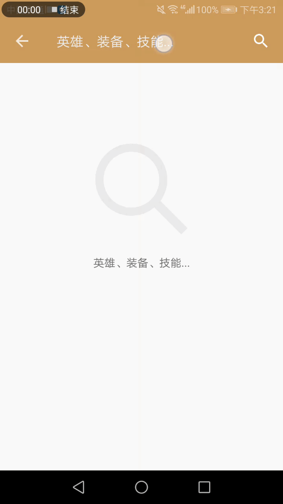

# 安卓开发期中项目实验报告

（2018秋季学期）

| 课程名称 | 手机平台应用开发 |   任课老师   |      郑贵锋      |
| :------: | :--------------: | :----------: | :--------------: |
|   年级   |       16级       | 专业（方向） | 软件工程（计应） |
|   学号   |     16340280     |     姓名     |      余漫霖      |
|   电话   |   15626273508    |    Email     | 624275782@qq.com |
| 开始日期 |    2018/11/04    |   完成日期   |    2018/11/24    |

---

## 一、实验题目

期中项目 - 王者荣耀英雄大全

## 二、实现内容

- 一个包括王者荣耀英雄人物头像、称号、名字、位置、生存能力值、攻击伤害值、技能效果值、上手难度值等信息的APP

## 三、实现的程序功能及截图

### 优化搜索：点击建议项，直接搜索

先前的效果是，点击提供的建议项，该建议项会填入搜索栏，但是并不跳转到搜索结果页面，需要点击搜索按钮才能跳转。

这样就需要点击两次，才能搜索该建议项，用户体验不够流畅。

优化后，点击建议项即可搜索该建议项。

动图如下：



### 桌面小工具：搜索入口

点击该小工具，可以打开应用的搜索页面。


### 分享图片

当存储权限打开时，可以分享装备/召唤师的属性卡片和英雄的人物卡片。


### 周免英雄推荐通知

如果从未打开过英雄列表，将不会推荐周免英雄。

如果打开过英雄列表，当天第一次打开应用后，或应用在后台运行到第二天后，会推送一个周免英雄。每天只推送一次。

点击该通知，可以跳转到该英雄的详情页面。


## 四、代码说明

### 优化搜索：点击建议项，直接跳转

#### `java/.../ui/activity/search/MaterialSearchView.java`

在600多行的源代码里，找到了设置建议项的点击事件的方法，原代码如下：

```java
    public void setSuggestions(String[] suggestions) {
        if (suggestions != null && suggestions.length > 0) {
            mTintView.setVisibility(VISIBLE);
            final SearchAdapter adapter = new SearchAdapter(mContext, suggestions, suggestionIcon, ellipsize);
            setAdapter(adapter);

            setOnItemClickListener((parent, view, position, id) -> setQuery(((String) adapter.getItem(position)).substring(1), submit));
        } else {
            mTintView.setVisibility(GONE);
        }
    }
```

`setQuery(CharSequence query, boolean submit)` ，将 `query` 填入搜索框，如果 `submit` 为 `true` 就提交搜索词进行搜索。

改变如下，只要点击了建议项，就一定提交：

```java
-            setOnItemClickListener((parent, view, position, id) -> setQuery(((String) adapter.getItem(position)).substring(1), submit));
+            setOnItemClickListener((parent, view, position, id) -> setQuery(((String) adapter.getItem(position)).substring(1), true));
```

### 桌面小工具：搜索入口

#### `res/layout/widget_search.xml`

小工具的布局由一个显示搜索提示的 `TextView` 和搜索按钮 `ImageView` 构成。

```java
<RelativeLayout xmlns:android="http://schemas.android.com/apk/res/android"
    android:id="@+id/search_widget"
    android:layout_width="match_parent"
    android:layout_height="match_parent"
    android:layout_marginHorizontal="30dp"
    android:layout_marginVertical="15dp"
    android:background="@drawable/widget_background"
    android:padding="@dimen/widget_margin">

    <TextView
        <!---->
        android:text="@string/menu_hint_search"
        android:layout_toStartOf="@id/search_button"/>

    <ImageView
        android:id="@+id/search_button"
        <!---->
        android:layout_alignParentEnd="true"
        android:src="@drawable/ic_search"/>

</RelativeLayout>
```

#### `res/xml/search_widget_info.xml`

```java
<?xml version="1.0" encoding="utf-8"?>
<appwidget-provider xmlns:android="http://schemas.android.com/apk/res/android"
    android:initialKeyguardLayout="@layout/widget_search"
    android:initialLayout="@layout/widget_search"
    <!---->
    android:resizeMode="horizontal"
    android:previewImage="@drawable/preview" />
```

#### `java/.../receiver/SearchWidget.java`

设置点击整个部件 `R.id.search_widget` 即会跳转到搜索页面。

`intent.putExtra("showSearch", true);` 告知搜索页面要马上获取焦点，准备接收用户输入。

```java
public class SearchWidget extends AppWidgetProvider {

    static void updateAppWidget(Context context, AppWidgetManager appWidgetManager,
                                int appWidgetId) {

        RemoteViews views = new RemoteViews(context.getPackageName(), R.layout.widget_search);
        Intent intent = new Intent(context, SearchActivity.class);
        intent.putExtra("showSearch", true);
        PendingIntent pending = PendingIntent.getActivity(context, 0, intent, PendingIntent.FLAG_UPDATE_CURRENT);
        views.setOnClickPendingIntent(R.id.search_widget, pending);
        ComponentName cn = new ComponentName(context, SearchWidget.class);
        appWidgetManager.updateAppWidget(cn, views);
    }

    // ...
}
```

#### `java/.../ui/activity/search/SearchActivity.java`

搜索页面判断是否要马上获取焦点，准备接收用户输入。

```java
    @Override
    protected void onCreate(@Nullable Bundle savedInstanceState) {
        // ...

        boolean showSearch = this.getIntent().getBooleanExtra("showSearch", false);
        if(showSearch) {
            binding.searchView.showSearch(false);
        }
    }
```

### 分享图片

#### `manifests/AndroidManifest.xml`

注册 `FileProvider` ，用于实现在不同应用之间的文件分享。

```java
<?xml version="1.0" encoding="utf-8"?>
<manifest xmlns:android="http://schemas.android.com/apk/res/android"
    xmlns:tools="http://schemas.android.com/tools"
    package="studio.xmatrix.qqpvp.assistant">

    <application
        <provider
            android:name="android.support.v4.content.FileProvider"
            android:authorities="studio.xmatrix.qqpvp.assistant.fileProvider"
            android:exported="false"
            android:grantUriPermissions="true">
            <meta-data
                android:name="android.support.FILE_PROVIDER_PATHS"
                android:resource="@xml/provider_paths"/>
        </provider>
    </application>
        
</manifest>
```

声明存储权限 `android.permission.WRITE_EXTERNAL_STORAGE` 。

```java
<?xml version="1.0" encoding="utf-8"?>
<manifest xmlns:android="http://schemas.android.com/apk/res/android"
    xmlns:tools="http://schemas.android.com/tools"
    package="studio.xmatrix.qqpvp.assistant">

    <uses-permission android:name="android.permission.WRITE_EXTERNAL_STORAGE" />
        
</manifest>
```

#### `java/.../ui/fragment/card/CardHandler.java`

检测应用有无存储权限：

```java
    private static boolean checkWritePermission(Activity activity) {
        int permissionCheck = ContextCompat.checkSelfPermission(activity, Manifest.permission.WRITE_EXTERNAL_STORAGE);
        return permissionCheck == PackageManager.PERMISSION_GRANTED;
    }
```

从uri获取实际的路径：

```java
    private static String getRealPathFromURI(Context context, Uri contentUri) {
        String[] proj = {MediaStore.Images.Media.DATA};
        try (Cursor cursor = context.getContentResolver().query(contentUri, proj, null, null, null)) {
            if (cursor == null) {
                return "";
            }
            int column_index = cursor.getColumnIndexOrThrow(MediaStore.Images.Media.DATA);
            cursor.moveToFirst();
            return cursor.getString(column_index);
        }
    }
```

如果有存储的授权，则：

- 调用 `View.draw` 创建图片
- 调用 `MediaStore.Images.Media.insertImage` 存储图片
- 调用自定义的 `getRealPathFromURI` 获取图片路径
- 调用 `FileProvider.getUriForFile` 返回该图片可供分享的uri

若没有授权，则返回一个空的uri：

```java
	public static Uri createShareFile(View v, Activity activity) {
        if(!checkWritePermission(activity)) return null;

        Bitmap bitmap = Bitmap.createBitmap(v.getMeasuredWidth(), v.getMeasuredHeight(), Bitmap.Config.ARGB_8888);
        Canvas canvas = new Canvas(bitmap);
        v.layout(v.getLeft(), v.getTop(), v.getRight(), v.getBottom());
        v.draw(canvas);
        bitmap = Bitmap.createBitmap(bitmap, 0, 5, v.getMeasuredWidth(), v.getMeasuredHeight() - 223);

        String filePath;
        filePath = MediaStore.Images.Media.insertImage(activity.getContentResolver(), bitmap, null, null);

        if (!bitmap.isRecycled()) {
            bitmap.recycle();
        }
        if (TextUtils.isEmpty(filePath)) {
            return null;
        }

        filePath = getRealPathFromURI(activity.getApplicationContext(), Uri.parse(filePath));
        File file = new File(filePath);
        return FileProvider.getUriForFile(activity.getApplicationContext(),
                BuildConfig.APPLICATION_ID + ".fileProvider", file);
    }
```

点击分享按钮的事件，根据 `createShareFile` 返回的uri，决定分享图片还是文本：

```java
    // 点击分享
    public void onClickShare(View v) {
        share(fragment.getView());
    }

	private void share(View v) {
    	Uri uri = createShareFile(v, activity);
    	Intent intent = new Intent(Intent.ACTION_SEND);
        if(uri == null) {
            // 分享文本
        }
        else {
            intent.setType("image/*");
            intent.putExtra(Intent.EXTRA_STREAM, uri);
            activity.startActivity(Intent.createChooser(intent, "分享"));
        }
	}
```

#### `java/.../ui/activity/menu/MenuActivity.java`

为了能够分享图片，需要在应用启动时请求存储权限。否则无法存储图片并分享。

`onRequestPermissionsResult` 是请求存储权限的结果回调方法。在这里，判断用户是否拒绝了开启存储权限，是否需要提醒用户。

```java
@Override
    protected void onCreate(@Nullable Bundle savedInstanceState) {
        // ...

        int permissionCheck = ContextCompat.checkSelfPermission(this, Manifest.permission.WRITE_EXTERNAL_STORAGE);
        if(permissionCheck != PackageManager.PERMISSION_GRANTED) {
            requestPermissions(new String[]{Manifest.permission.WRITE_EXTERNAL_STORAGE}, 0);
        }

        // ...
    }

    @Override
    public void onRequestPermissionsResult(int requestCode, @NonNull String[] permissions, @NonNull int[] grantResults) {
        super.onRequestPermissionsResult(requestCode, permissions, grantResults);
        if(requestCode != 0 ) return;
        if(grantResults.length == 0 ||
                grantResults[0] != PackageManager.PERMISSION_GRANTED &&
                ActivityCompat.shouldShowRequestPermissionRationale(this, permissions[0])){
            Toast.makeText(this, "您关闭了存储权限，将无法分享图片", Toast.LENGTH_SHORT).show();
        }
    }
```

### 周免英雄推荐通知

#### `java/.../ui/activity/list/ListHeroHandler`

在初始化英雄列表时，获取周免英雄，存入 `SharedPreferences` 。

`SharedPreferences` 存储周免英雄 `freeHero` ，类型为 `StringSet` ，每个字符串表示为周免英雄的 `id + "," + name` 。

```java
    public void initList() {
        setAdapter();
        viewModel.getHeroList().observe(activity, resource -> {
            if (resource != null) {
                switch (resource.status) {
                    // ...
                    case SUCCESS:
                        // ...
                        Set<String> freehero = new HashSet<>();
                        boolean save = !FreeNotification.isUpdated(activity);
                        if(save) {
                            for (HeroListItem item : resource.data){
                                if(item.isFreeHero()) {
                                    freehero.add(Integer.toString(item.getId()) + "," + item.getName());
                                }
                            }
                            FreeNotification.updateFreeHero(activity, freehero);
                            activity.startService(new Intent(activity, FreeNotification.class));
                        }
                        break;
                }
            }
        });
    }
```

#### `java/.../receiver/FreeNotification.java`

`FreeNotification` 是一个服务类，用来控制周免英雄推荐通知的发送。

```java
public class FreeNotification extends Service {
    @Override
    public void onCreate() {
        super.onCreate();
    }

    @Override
    public int onStartCommand(Intent intent, int flags, int startId) {
        AlarmManager manager = (AlarmManager) getSystemService(ALARM_SERVICE);
        int interval = 24*60*60*1000;
        long firstTime = SystemClock.elapsedRealtime() + 5000;
        Intent i = new Intent(this, AlarmReceiver.class);
        PendingIntent pi = PendingIntent.getBroadcast(this, 0, i, 0);
        manager.setRepeating(AlarmManager.ELAPSED_REALTIME_WAKEUP, firstTime, interval, pi);
        return super.onStartCommand(intent, flags, startId);
    }

    @Override
    public void onDestroy() {
        super.onDestroy();
    }
}

```

`onStartCommand` 设置定时推送事件，服务启动5秒后第一次触发事件，之后每24小时触发一次事件。

`PendingIntent.getBroadcast` 获取一个能够执行广播的 `PendingIntent` 。

```java
    @Override
    public int onStartCommand(Intent intent, int flags, int startId) {
        AlarmManager manager = (AlarmManager) getSystemService(ALARM_SERVICE);
        int interval = 24*60*60*1000;
        long firstTime = SystemClock.elapsedRealtime() + 5000;
        Intent i = new Intent(this, AlarmReceiver.class);
        PendingIntent pi = PendingIntent.getBroadcast(this, 0, i, 0);
        manager.setRepeating(AlarmManager.ELAPSED_REALTIME_WAKEUP, firstTime, interval, pi);
        return super.onStartCommand(intent, flags, startId);
    }
```

为了能判断是否需要更新周免英雄、是否需要推送（存储的周免英雄是否已更新、当天是否已经推送过），使用 `SharedPreferences` 来记录所存储的周免英雄对应的周 `freeweek` ，上次推送周免英雄的日子 `day` 。将它们与当前周、日对比，即可决定是否需要推送。

`boolean isUpdated(Context context)` 判断存储的周免英雄是否已更新。可用于在初始化英雄列表时判断是否需要存储周免英雄。

```java
    public static boolean isUpdated(Context context) {
        SharedPreferences sharedPreferences = context.getSharedPreferences(
                context.getString(R.string.preference), Context.MODE_PRIVATE);
        int lastweek = sharedPreferences.getInt("freeweek", -1);
        int thisweek = getWeek();
        return lastweek == thisweek;
    }
```

`boolean shouldNotify(Context context)` 判断是否需要推送周免英雄。

```java
    public static boolean shouldNotify(Context context) {
        SharedPreferences sharedPreferences = context.getSharedPreferences(
                context.getString(R.string.preference), Context.MODE_PRIVATE);
        int lastday = sharedPreferences.getInt("day", -1);
        int thisday = Calendar.getInstance().get(Calendar.DAY_OF_YEAR);
        return lastday != thisday && isUpdated(context);
    }
```

获取当前日历的周、日，更新存储的上一次推送日、英雄，供别的类调用。

```java
public class FreeNotification extends Service {

	// 获取当前的周
    private static int getWeek() {
        Calendar calendar = Calendar.getInstance();
        int thisweek = calendar.get(Calendar.WEEK_OF_MONTH);
        int thisday = calendar.get(Calendar.DAY_OF_WEEK);
        if(thisday == Calendar.SUNDAY) return thisweek - 1;
        return thisweek;
    }

    // 获取当前是星期几
    public static int getWeekDay() {
        Calendar calendar = Calendar.getInstance();
        return calendar.get(Calendar.DAY_OF_WEEK);
    }

	// 更新存储的上一次推送的日子
    public static void updateDay(Context context) {
        SharedPreferences sharedPreferences = context.getSharedPreferences(
                context.getString(R.string.preference), Context.MODE_PRIVATE);
        int thisday = Calendar.getInstance().get(Calendar.DAY_OF_YEAR);
        sharedPreferences.edit().putInt("day", thisday).commit();
    }

    // 更新存储的英雄
    public static void updateFreeHero(Context context, Set<String> freehero) {
        SharedPreferences sharedPreferences = context.getSharedPreferences(
                context.getString(R.string.preference), Context.MODE_PRIVATE);
        SharedPreferences.Editor editor = sharedPreferences.edit();
        editor.putStringSet("freehero", freehero);
        int thisweek = getWeek();
        editor.putInt("freeweek", thisweek).commit();
    }

}

```

#### `java/.../ui/activity/menu/MenuActivity.java`

检测是否需要推送，如果需要就启动 `FreeNotification` 服务，并更新推送的日子。

```java
	@Override
    protected void onCreate(@Nullable Bundle savedInstanceState) {
        // ...
        
        if(FreeNotification.shouldNotify(this)) {
            startService(new Intent(this, FreeNotification.class));
            FreeNotification.updateDay(this);
        }
    }
```

#### `java/.../receiver/AlarmReceiver.java`

`AlarmReceiver ` 接收来自 `FreeNotification` 服务的广播，从 `SharedPreferences` 中取出一个周免英雄，进行推送通知。

```java
public class AlarmReceiver extends BroadcastReceiver {
    @Override
    public void onReceive(Context context, Intent intent) {
        if(!FreeNotification.isUpdated(context)) return;
        SharedPreferences sharedPreferences = context.getSharedPreferences(
                context.getString(R.string.preference), Context.MODE_PRIVATE);
        ArrayList<String> freehero = new ArrayList<>(sharedPreferences.getStringSet("freehero", new ArraySet<>()));
        if(freehero.isEmpty()) return;

        String channelID = "free";
        String channelName = "FreeChannel";
        NotificationChannel channel = new NotificationChannel(channelID,
                channelName, NotificationManager.IMPORTANCE_HIGH);
        NotificationManager manager = (NotificationManager) context.getSystemService(Context.NOTIFICATION_SERVICE);
        manager.createNotificationChannel(channel);
        Notification.Builder builder = new Notification.Builder(context, channelID);

        int day = FreeNotification.getWeekDay() - 1;
        String hero = freehero.get(day);
        String[] heroAttr = hero.split(",");
        String heroID = heroAttr[0];
        String heroName = heroAttr[1];
        Intent contentIntent = new Intent(context, HeroDetailActivity.class);
        Bundle bundle = new Bundle();
        bundle.putInt("id", Integer.valueOf(heroID));
        contentIntent.putExtras(bundle);
        PendingIntent pendingIntent = PendingIntent.getActivity(context, 0,
                contentIntent, PendingIntent.FLAG_CANCEL_CURRENT);
        builder.setSmallIcon(R.mipmap.ic_launcher)
                .setTicker("周免英雄推荐")
                .setContentTitle(heroName)
                .setContentText("点击查看该周免英雄详情")
                .setContentIntent(pendingIntent)
                .setAutoCancel(true);
        Notification notification = builder.build();
        manager.notify((int)System.currentTimeMillis(),notification);
        FreeNotification.updateDay(context);
    }
}

```

#### `manifests/AndroidManifest.xml`

注册服务 `FreeNotification` 和静态广播接收器 `AlarmReceiver` 。

```java
<?xml version="1.0" encoding="utf-8"?>
<manifest xmlns:android="http://schemas.android.com/apk/res/android"
    xmlns:tools="http://schemas.android.com/tools"
    package="studio.xmatrix.qqpvp.assistant">

    <application
        <service
            android:name=".receiver.FreeNotification"
            android:enabled="true"
            android:process="system"/>

        <receiver android:name=".receiver.AlarmReceiver" />
    </application>
</manifest>
```

## 五、实验遇到的困难及解决思路

###  桌面小工具

- **无法加载桌面小工具**

一开始，我为桌面小工具添加了 `EditText` 控件，因为我希望它可以输入关键词进行搜索。但是这样就会显示“无法加载桌面小工具”。

我以为是 `App Widget` 不支持这个输入控件，而支持别的，于是又换了几次，仍然无法加载。但是去掉输入控件后，就能够加载了。

经查询 [Creating the App Widget Layout](https://developer.android.com/guide/topics/appwidgets/#CreatingLayout)，原来 `App Widget` 能添加的控件是有限制的：

> A RemoteViews object (and, consequently, an App Widget) can support the following layout classes:
>
> - `FrameLayout`
> - `LinearLayout`
> - `RelativeLayout`
>
> And the following widget classes:
>
> - `AnalogClock`
> - `Button`
> - `Chronometer`
> - `ImageButton`
> - `ImageView`
> - `ProgressBar`
> - `TextView`
> - `ViewFlipper`
> - `ListView`
> - `GridView`
> - `StackView`
> - `AdapterViewFlipper`
>
> Descendants of these classes are not supported.

观察其他桌面搜索小工具，比如欧路词典、浏览器，可见点击它们后都是打开一个页面进行输入，而非直接在桌面小工具输入搜索。

所以，我最终把 `EditText` 改成了 `TextView` ，提供搜索提示。点击该桌面小工具后，会打开应用的搜索页面。

- **桌面小工具固定高度**

需求是桌面小工具的高度固定，因为拉伸高度后视觉效果较差。

在 `App Widget` 配置文件里的 `appwidget-provider` 标签中，有一个属性 `resizeMode` ，我猜测它和拉伸有关系。

它的默认属性是 `horizontal|vertical` ，我改成 `horizontal` 后，桌面小工具的高度就变成不可拉伸的了。

- **预览图**

需求是桌面小工具的预览图能够与桌面小工具的布局显示一致。

经查询，`App Widget` 中的 `previewImage` 属性只能使用图片资源。而前面【分享图片】中的由视图生成位图的方法，并不适用于这里使用的 `RemoteViews` 。

一种方法是，直接截图，作为预览图；根据资料 [Setting a Preview Image](https://developer.android.com/guide/topics/appwidgets/#preview)，还有一种方法，使用安卓模拟器上的 Widget Preview来为桌面小工具生成符合布局的预览图：

> To help create a preview image for your app widget (to specify in the `previewImage` field), the Android emulator includes an application called "Widget Preview." To create a preview image, launch this application, select the app widget for your application and set it up how you'd like your preview image to appear, then save it and place it in your application's drawable resources.

然而，在我 API 28的模拟器上，并没有Widget Preview这个应用。根据StackOverflow上的问答 [Widget Preview app missing from Android emulator](https://stackoverflow.com/questions/50860531/widget-preview-app-missing-from-android-emulator) ，可以使用版本较低的模拟器。

但使用API 27和API 26的模拟器，又报错 `Error saving preview` 。队友为我提供了这个应用的安装包，于是我终于成功地在API 28模拟器上生成了桌面小部件的预览图，生成的图片的效果好于直接截图。

###  分享图片

- **请求开启权限**

最初我是选择在点击分享后，检测存储权限并请求；但是同意开启权限、分享完毕后，返回应用，应用已经不在刚才的页面了，而是回到了首页。

所以我选择在应用启动时即请求权限，这也是安卓市场中不少应用的做法。

- **不重复提醒开启权限**

当用户拒绝了开启权限的请求后，应用会发送 `Toast` 提醒用户关闭权限后将无法分享图片。

每次启动应用时应当请求权限，但用户可能勾选了“禁止后不再询问”，所以不会再弹出请求权限的对话框，但是还是有 `Toast` 提醒出现。

怎么判断能不能再次询问呢？

根据资料，可以使用以下这个方法来判断，返回值为 `false` 即为禁止后不再询问。

```java
ActivityCompat.shouldShowRequestPermissionRationale(@NonNull Activity activity, @NonNull String permission)
```

在 `MenuActivity` 的请求权限回调方法里加上它，以判断是否要弹出提醒。

```java
    @Override
    public void onRequestPermissionsResult(int requestCode, @NonNull String[] permissions, @NonNull int[] grantResults) {
        super.onRequestPermissionsResult(requestCode, permissions, grantResults);
        if(requestCode != 0 ) return;
        if(grantResults.length == 0 ||
                grantResults[0] != PackageManager.PERMISSION_GRANTED &&
                ActivityCompat.shouldShowRequestPermissionRationale(this, permissions[0])){
            Toast.makeText(this, "您关闭了存储权限，将无法分享图片", Toast.LENGTH_SHORT).show();
        }
    }
```

值得注意的是，如果像下面这么写，先判断 `ActivityCompat.shouldShowRequestPermissionRationale` 再决定要不要请求，是不会有权限请求对话框出现的。猜想这是因为这个方法在用户未选择的情况下，默认返回 `false` 。那样，把它放到弹出请求权限对话框、用户进行选择之前，就会出现问题。

```java
public class MenuActivity extends AppCompatActivity {

    @Override
    protected void onCreate(@Nullable Bundle savedInstanceState) {
        // ...

        String[] permissions = new String[]{Manifest.permission.WRITE_EXTERNAL_STORAGE};
        int permissionCheck = ContextCompat.checkSelfPermission(this, permissions[0]);
        if(permissionCheck != PackageManager.PERMISSION_GRANTED
                && ActivityCompat.shouldShowRequestPermissionRationale(this, permissions[0])) {
            requestPermissions(permissions, 0);
        }

        // ...
    }

    @Override
    public void onRequestPermissionsResult(int requestCode, @NonNull String[] permissions, @NonNull int[] grantResults) {
        super.onRequestPermissionsResult(requestCode, permissions, grantResults);
        if(requestCode != 0 ) return;
        if(grantResults.length == 0 ||
                grantResults[0] != PackageManager.PERMISSION_GRANTED){
            Toast.makeText(this, "您关闭了存储权限，将无法分享图片", Toast.LENGTH_SHORT).show();
        }
    }
}
```

## 六、实验思考及感想

1. 在我负责的部分，我使用的课堂知识点有：

  - `App Widget`
  - `SharedPreferences`
  - 发送通知

  扩展的知识点有：

  - 检查授权、请求授权

  - 由视图生成图片

  - `MediaStore.Images.Media.insertImage` 保存图片

  - 分享图片

  - 后台服务

  - `AlarmManager` 定时任务

  实践是最好的老师，我为了实现程序的需求而查找了很多资料，也增长了不少知识。比方说某篇博客中表示，Android 中的定时任务一般有两种实现方式，一种是使用Java API 里提供的Timer 类，一种是使用Android 的Alarm机制。这两种方式在多数情况下都能实现类似的效果，但Timer有一个明显的短板，它并不太适用于那些需要长期在后台运行的定时任务。而Alarm 机制则不存在这种情况，它具有唤醒CPU 的功能，即可以保证每次需要执行定时任务的时候CPU 都能正常工作。因此我在本次任务中选择使用Alarm机制来实现定时任务。 

2. 网上的资料和代码良莠不齐，而且安卓更新换代比较快，学习时要注意代码的版本。感谢网友们的博客指出各种各样的坑。安卓官方文档和Stack Overflow都是不错的解决问题的途径。

3. 感谢我的队友，搭了一个比较完整的架构，引用了不少第三方库，这对我来说是一个很好的观摩学习的机会，接触到了更多课堂之外的东西。


