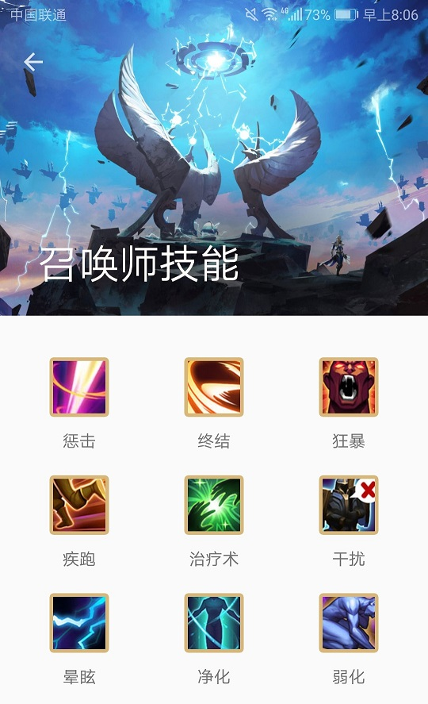
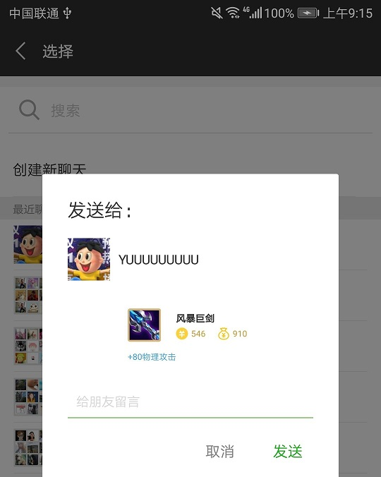

* [王者荣耀助手用户手册](#%E7%8E%8B%E8%80%85%E8%8D%A3%E8%80%80%E5%8A%A9%E6%89%8B%E7%94%A8%E6%88%B7%E6%89%8B%E5%86%8C)
  * [应用权限](#%E5%BA%94%E7%94%A8%E6%9D%83%E9%99%90)
  * [开始](#%E5%BC%80%E5%A7%8B)
  * [英雄](#%E8%8B%B1%E9%9B%84)
    * [英雄列表](#%E8%8B%B1%E9%9B%84%E5%88%97%E8%A1%A8)
    * [英雄详情](#%E8%8B%B1%E9%9B%84%E8%AF%A6%E6%83%85)
      * [概览](#%E6%A6%82%E8%A7%88)
      * [资料](#%E8%B5%84%E6%96%99)
        * [英雄属性](#%E8%8B%B1%E9%9B%84%E5%B1%9E%E6%80%A7)
        * [英雄关系](#%E8%8B%B1%E9%9B%84%E5%85%B3%E7%B3%BB)
        * [英雄故事](#%E8%8B%B1%E9%9B%84%E6%95%85%E4%BA%8B)
      * [技能](#%E6%8A%80%E8%83%BD)
        * [技能介绍](#%E6%8A%80%E8%83%BD%E4%BB%8B%E7%BB%8D)
        * [推荐加点](#%E6%8E%A8%E8%8D%90%E5%8A%A0%E7%82%B9)
      * [出装](#%E5%87%BA%E8%A3%85)
        * [推荐出装](#%E6%8E%A8%E8%8D%90%E5%87%BA%E8%A3%85)
        * [推荐铭文](#%E6%8E%A8%E8%8D%90%E9%93%AD%E6%96%87)
  * [装备](#%E8%A3%85%E5%A4%87)
    * [装备列表](#%E8%A3%85%E5%A4%87%E5%88%97%E8%A1%A8)
    * [装备属性](#%E8%A3%85%E5%A4%87%E5%B1%9E%E6%80%A7)
  * [召唤师技能](#%E5%8F%AC%E5%94%A4%E5%B8%88%E6%8A%80%E8%83%BD)
    * [技能列表](#%E6%8A%80%E8%83%BD%E5%88%97%E8%A1%A8)
    * [技能属性](#%E6%8A%80%E8%83%BD%E5%B1%9E%E6%80%A7)
  * [收藏](#%E6%94%B6%E8%97%8F)
    * [收藏列表](#%E6%94%B6%E8%97%8F%E5%88%97%E8%A1%A8)
    * [收藏项操作](#%E6%94%B6%E8%97%8F%E9%A1%B9%E6%93%8D%E4%BD%9C)
      * [添加备注](#%E6%B7%BB%E5%8A%A0%E5%A4%87%E6%B3%A8)
      * [删除收藏](#%E5%88%A0%E9%99%A4%E6%94%B6%E8%97%8F)
  * [搜索](#%E6%90%9C%E7%B4%A2)
  * [分享](#%E5%88%86%E4%BA%AB)
  * [桌面小工具](#%E6%A1%8C%E9%9D%A2%E5%B0%8F%E5%B7%A5%E5%85%B7)
  * [周免英雄推荐](#%E5%91%A8%E5%85%8D%E8%8B%B1%E9%9B%84%E6%8E%A8%E8%8D%90)

# 王者荣耀助手用户手册

王者荣耀助手是一个提供对王者荣耀英雄、装备、召唤师技能的查询、收藏、分享等功能的安卓应用。

## 应用权限

- 存储
  - 该权限用于保存和分享英雄的人物卡片和装备/召唤师的属性卡片。
  - 将在应用启动时检测是否开启，若未开启则进行请求。
  - 你可以选择开启或关闭它。关闭它并不影响该应用的运行。

## 开始

开始页面有四个列表入口：英雄、装备、技能、收藏，各自导航到一个相关的列表。

开始页面也提供了搜索入口，导航到搜索页面。

## 英雄

### 英雄列表

英雄列表页展示了王者荣耀的所有英雄。

悬浮按钮提供了对英雄类型的筛选。

### 英雄详情

点击英雄列表中的某个英雄，可以查看该英雄的详情。

#### 概览

详情页面顶部标明了英雄的类型，并且可以切换展示皮肤。

右上角提供了分享按钮。

请注意：分享英雄的人物卡片需要开启存储权限。如果存储权限未开启，将只分享该英雄的名称和相关链接。

动画效果：

上滑收起顶部后，收藏按钮出现。

#### 资料

##### 英雄属性

这里提供了四个可量化的英雄属性：生存能力、攻击伤害、技能效果、上手难度。

##### 英雄关系

英雄关系包括最佳伙伴、克制英雄、被克制英雄。

你可以点击某个英雄，查看TA与当前英雄的具体关系。

你也可以长按该英雄，进入该英雄的详情页面。

##### 英雄故事

展示了当前英雄的故事。

#### 技能

##### 技能介绍

介绍了当前英雄的不同技能。

##### 推荐加点

提供了对技能加点的建议。

#### 出装

##### 推荐出装

有多个推荐的出装组合，可以通过刷新按钮来切换查看。

##### 推荐铭文

提供了对铭文搭配的建议。

## 装备

### 装备列表

装备列表页展示了王者荣耀的所有局内道具。

悬浮按钮提供了对装备类型的筛选。

### 装备属性

装备属性卡片展示了装备的售价（左边）和总价（右边），以及装备的加成效果。

你可以在卡片上选择收藏或分享该装备。

请注意：分享装备卡片需要开启存储权限。如果存储权限未开启，将只分享该装备的名称和相关链接。

## 召唤师技能

### 技能列表

召唤师技能列表页展示了王者荣耀的所有召唤师技能。

### 技能属性

召唤师技能属性卡片展示了召唤师技能的释放效果图、解锁所需的级别、技能冷却时间、技能效果的量化说明。

你可以在卡片上选择收藏或分享该召唤师技能。

## 收藏

你可以在英雄详情的顶栏选择收藏该英雄。

你可以在装备/召唤师技能的属性卡片上选择收藏该装备/召唤师技能。

### 收藏列表

收藏列表页展示了所有已收藏的装备和召唤师技能。

### 收藏项操作

点击收藏项，可以显示该收藏项（装备/召唤师技能）的属性卡片或跳转到该收藏项（英雄）的详情页面。

#### 添加备注

对收藏项向右侧滑，可以为收藏项添加备注。

#### 删除收藏

对收藏项向左侧滑，可以删除该收藏项。

你也可以在该收藏项的属性卡片或详情页面点击取消收藏。

## 搜索

开始页面的搜索栏提供了搜索页面的入口。点击搜索页面的顶栏或搜索按钮，即可开始输入搜索关键词。

搜索栏会根据你的输入为你生成搜索建议，点击某个建议项即可跳转到该推荐项的搜索结果。

点击键盘上的搜索键，即可搜索当前的输入。

## 分享

你可以在英雄的详情页面，或者装备/召唤师技能的卡片上选择分享它。

如果存储权限已开启，将分享该英雄的人物卡片或装备/召唤师技能的属性卡片。

如果存储权限未开启，将分享该英雄/装备/召唤师技能的名称和相关链接。

## 桌面小工具

你可以通过桌面小工具，直接进入王者荣耀助手的搜索页面。

## 周免英雄推荐

如果本周未打开过英雄列表，将不会推荐周免英雄。

如果打开过英雄列表，每天你打开王者荣耀助手后，或王者荣耀助手在后台运行时，到一定的时间，会为你推荐一个本周的免费英雄。

一天只推荐一个周免英雄。

点击该通知，可跳转到该英雄的详情页面。

